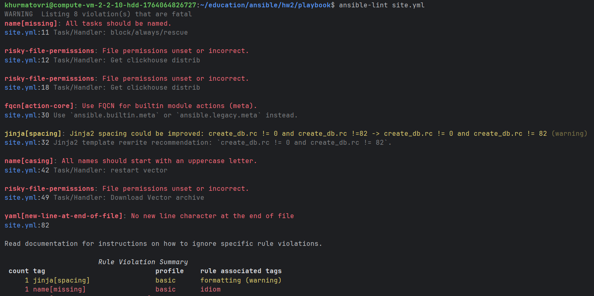
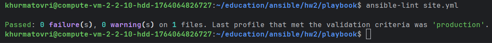
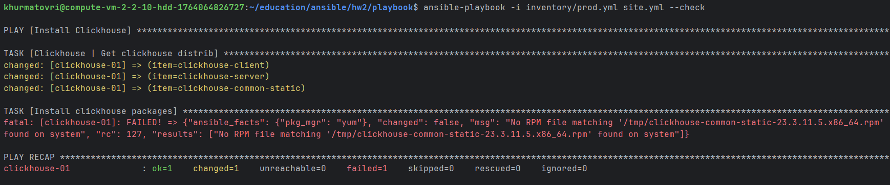
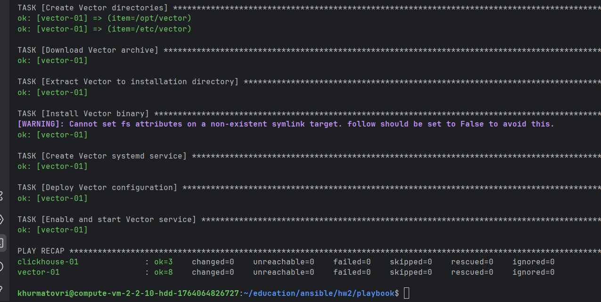
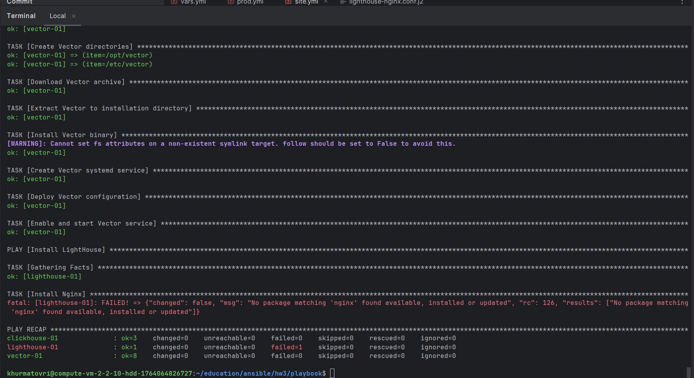

# Домашнее задание к занятию 3 «Использование Ansible»

## Подготовка к выполнению

1. Подготовьте в Yandex Cloud три хоста: для `clickhouse`, для `vector` и для `lighthouse`.
2. Репозиторий LightHouse находится [по ссылке](https://github.com/VKCOM/lighthouse).

## Основная часть

1. Допишите playbook: нужно сделать ещё один play, который устанавливает и настраивает LightHouse.
2. При создании tasks рекомендую использовать модули: `get_url`, `template`, `yum`, `apt`.
3. Tasks должны: скачать статику LightHouse, установить Nginx или любой другой веб-сервер, настроить его конфиг для открытия LightHouse, запустить веб-сервер.
4. Подготовьте свой inventory-файл `prod.yml`.
5. Запустите `ansible-lint site.yml` и исправьте ошибки, если они есть.
6. Попробуйте запустить playbook на этом окружении с флагом `--check`.
7. Запустите playbook на `prod.yml` окружении с флагом `--diff`. Убедитесь, что изменения на системе произведены.
8. Повторно запустите playbook с флагом `--diff` и убедитесь, что playbook идемпотентен.
9. Подготовьте README.md-файл по своему playbook. В нём должно быть описано: что делает playbook, какие у него есть параметры и теги.
10. Готовый playbook выложите в свой репозиторий, поставьте тег `08-ansible-03-yandex` на фиксирующий коммит, в ответ предоставьте ссылку на него.

---

### Как оформить решение задания

Выполненное домашнее задание пришлите в виде ссылки на .md-файл в вашем репозитории.

---

## Ответы к основной части

1. Допишите playbook: нужно сделать ещё один play, который устанавливает и настраивает LightHouse.
2. При создании tasks рекомендую использовать модули: `get_url`, `template`, `yum`, `apt`.
3. Tasks должны: скачать статику LightHouse, установить Nginx или любой другой веб-сервер, настроить его конфиг для открытия LightHouse, запустить веб-сервер.
```
- name: Install LightHouse
  hosts: lighthouse
  handlers:
    - name: Restart nginx
      become: true
      ansible.builtin.service:
        name: nginx
        state: restarted

  tasks:
    - name: Install EPEL repository (CentOS/RHEL)
      become: true
      ansible.builtin.yum:
        name: epel-release
        state: present
      when: ansible_os_family == "RedHat"

    # Установка Nginx
    - name: Install Nginx
      become: true
      ansible.builtin.yum:
        name: nginx
        state: present
      when: ansible_os_family == "RedHat"

    # Создание директории для LightHouse
    - name: Create LightHouse directory
      become: true
      ansible.builtin.file:
        path: "{{ lighthouse_install_dir }}"
        state: directory
        mode: '0755'
        owner: "{{ nginx_user }}"
        group: "{{ nginx_user }}"

    # Скачивание статики LightHouse
    - name: Download LightHouse static files
      become: true
      ansible.builtin.get_url:
        url: "{{ lighthouse_download_url }}"
        dest: "/tmp/lighthouse-{{ lighthouse_version }}.tar.gz"
        timeout: 60
        mode: '0644'

    # Распаковка LightHouse
    - name: Extract LightHouse
      become: true
      ansible.builtin.unarchive:
        src: "/tmp/lighthouse-{{ lighthouse_version }}.tar.gz"
        dest: "/tmp"
        remote_src: true
        creates: "/tmp/lighthouse-{{ lighthouse_version }}"

    # Копирование статики в веб-директорию
    - name: Copy LightHouse demo to web directory
      become: true
      ansible.builtin.copy:
        src: "/tmp/lighthouse-{{ lighthouse_version }}/docs/demo/"
        dest: "{{ lighthouse_install_dir }}"
        remote_src: true
        owner: "{{ nginx_user }}"
        group: "{{ nginx_user }}"
        mode: '0755'

    # Настройка конфига Nginx
    - name: Deploy Nginx configuration for LightHouse
      become: true
      ansible.builtin.template:
        src: lighthouse-nginx.conf.j2
        dest: "{{ nginx_conf_dir }}/lighthouse.conf"
        mode: '0644'
      notify: Restart nginx

    # Запуск Nginx
    - name: Start and enable Nginx
      become: true
      ansible.builtin.service:
        name: nginx
        state: started
        enabled: true

```

4. Подготовьте свой inventory-файл `prod.yml`.
```
---
clickhouse:
  hosts:
    clickhouse-01:
      ansible_host: 158.160.92.157
      ansible_user: centos
      ansible_ssh_private_key_file: "~/.ssh/id_centos_vm"
vector:
  hosts:
    vector-01:
      ansible_host: 158.160.69.145
      ansible_user: centos
      ansible_ssh_private_key_file: "~/.ssh/id_centos_vm"
lighthouse:
  hosts:
    lighthouse-01:
      ansible_host: 178.154.193.161
      ansible_user: centos
      ansible_ssh_private_key_file: "~/.ssh/id_centos_vm"
```

5. Запустите `ansible-lint site.yml` и исправьте ошибки, если они есть.


Исправляем ошибки и запускаем повторно


6. Попробуйте запустить playbook на этом окружении с флагом `--check`.

Ошибка появляется из-за того, что playbook с флагом `--check` не создает директории, не скачивает файлы, просто делает проверку кода

7. Запустите playbook на `prod.yml` окружении с флагом `--diff`. Убедитесь, что изменения на системе произведены.


8. Повторно запустите playbook с флагом `--diff` и убедитесь, что playbook идемпотентен.

Как видим изменений нет, значит playbook идемпотентен

9. Подготовьте README.md-файл по своему playbook. В нём должно быть описано: что делает playbook, какие у него есть параметры и теги.
# Ansible Playbook для установки и настройки LightHouse

## Описание

Данный playbook устанавливает и настраивает **LightHouse** - статический веб-интерфейс для анализа производительности, развернутый на веб-сервере Nginx.

LightHouse предоставляет демо-страницы для тестирования и анализа веб-приложений, доступные через браузер.

## Что делает playbook

### Основные задачи:
1. **Устанавливает веб-сервер Nginx**:
    - Для CentOS/RHEL: добавляет EPEL репозиторий и устанавливает Nginx
    - Для Ubuntu/Debian: устанавливает Nginx через стандартные репозитории
    - Автоматически определяет ОС и выбирает правильный менеджер пакетов

2. **Скачивает статику LightHouse**:
    - Загружает архив LightHouse с GitHub Releases
    - Распаковывает архив во временную директорию
    - Копирует демо-страницы LightHouse в веб-директорию

3. **Настраивает Nginx**:
    - Создает конфигурационный файл через Jinja2 шаблон
    - Настраивает виртуальный хост для обслуживания LightHouse
    - Конфигурирует обработку статических файлов

4. **Запускает и настраивает сервис**:
    - Запускает Nginx сервис
    - Включает автозагрузку при старте системы
    - Реализует автоматический перезапуск при изменении конфигурации

## Параметры (Variables)

Все параметры LightHouse определены в `group_vars/lighthouse/vars.yml`:

```yaml
# Версия LightHouse
lighthouse_version: "9.3.0"

# Директория установки
lighthouse_install_dir: "/var/www/lighthouse"

# Конфигурация Nginx
nginx_user: "www-data"
nginx_conf_dir: "/etc/nginx/conf.d"

# URL для скачивания LightHouse
lighthouse_download_url: "https://github.com/GoogleChrome/lighthouse/archive/refs/tags/v{{ lighthouse_version }}.tar.gz"

# Настройки сервера Nginx
nginx_server_name: "{{ ansible_host | default(inventory_hostname) }}"
nginx_listen_port: 80
```

10. Готовый playbook выложите в свой репозиторий, поставьте тег `08-ansible-03-yandex` на фиксирующий коммит, в ответ предоставьте ссылку на него. 
https://github.com/Khurmatov/education/commit/ef4a5b28648a5fa0b3c953e4e191c05003cb2827