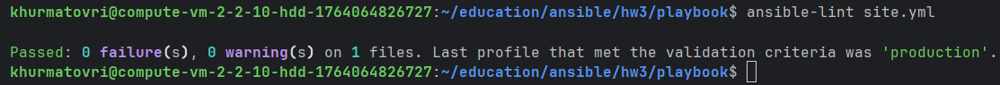
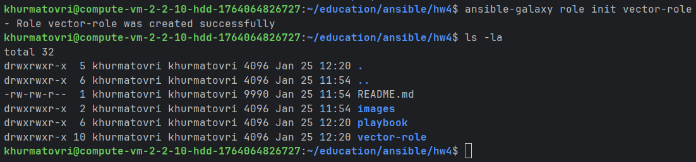

# Домашнее задание к занятию 4 «Работа с roles»

## Подготовка к выполнению

1. * Необязательно. Познакомьтесь с [LightHouse](https://youtu.be/ymlrNlaHzIY?t=929).
2. Создайте два пустых публичных репозитория в любом своём проекте: vector-role и lighthouse-role.
3. Добавьте публичную часть своего ключа к своему профилю на GitHub.

## Основная часть

Ваша цель — разбить ваш playbook на отдельные roles.

Задача — сделать roles для ClickHouse, Vector и LightHouse и написать playbook для использования этих ролей.

Ожидаемый результат — существуют три ваших репозитория: два с roles и один с playbook.

**Что нужно сделать**

1. Создайте в старой версии playbook файл `requirements.yml` и заполните его содержимым:

   ```yaml
   ---
     - src: git@github.com:AlexeySetevoi/ansible-clickhouse.git
       scm: git
       version: "1.13"
       name: clickhouse 
   ```

2. При помощи `ansible-galaxy` скачайте себе эту роль.
3. Создайте новый каталог с ролью при помощи `ansible-galaxy role init vector-role`.
4. На основе tasks из старого playbook заполните новую role. Разнесите переменные между `vars` и `default`.
5. Перенести нужные шаблоны конфигов в `templates`.
6. Опишите в `README.md` обе роли и их параметры. Пример качественной документации ansible role [по ссылке](https://github.com/cloudalchemy/ansible-prometheus).
7. Повторите шаги 3–6 для LightHouse. Помните, что одна роль должна настраивать один продукт.
8. Выложите все roles в репозитории. Проставьте теги, используя семантическую нумерацию. Добавьте roles в `requirements.yml` в playbook.
9. Переработайте playbook на использование roles. Не забудьте про зависимости LightHouse и возможности совмещения `roles` с `tasks`.
10. Выложите playbook в репозиторий.
11. В ответе дайте ссылки на оба репозитория с roles и одну ссылку на репозиторий с playbook.

---

### Как оформить решение задания

Выполненное домашнее задание пришлите в виде ссылки на .md-файл в вашем репозитории.

---

## Ответы к основной части

Ваша цель — разбить ваш playbook на отдельные roles. - Выполнено
Задача — сделать roles для ClickHouse, Vector и LightHouse и написать playbook для использования этих ролей. - Выполнено
Ожидаемый результат — существуют три ваших репозитория: два с roles и один с playbook. - Выполнено
- https://github.com/Khurmatov/lighthouse-role
- https://github.com/Khurmatov/vector-role
- https://github.com/Khurmatov/education/tree/devops-course/ansible/hw4/playbook

**Что нужно сделать**

1. Создайте в старой версии playbook файл `requirements.yml` и заполните его содержимым:
```
---
roles:
  - src: git@github.com:AlexeySetevoi/ansible-clickhouse.git
    scm: git
    version: "1.13"
    name: clickhouse
  - src: git@github.com:Khurmatov/lighthouse-role.git
    scm: git
    version: "1.0.0"
    name: lighthouse
  - src: git@github.com:Khurmatov/vector-role.git
    scm: git
    version: "1.0.0"
    name: vector
```

2. При помощи `ansible-galaxy` скачайте себе эту роль.


3. Создайте новый каталог с ролью при помощи `ansible-galaxy role init vector-role`.


4. На основе tasks из старого playbook заполните новую role. Разнесите переменные между `vars` и `default`.
`roles/vector-role/tasks/main.yml`:
```
---
# Создание директорий
- name: Create Vector directories
  become: true
  ansible.builtin.file:
    path: "{{ item }}"
    state: directory
    mode: '0755'
  loop:
    - "{{ vector_install_dir }}"
    - "{{ vector_config_dir }}"
  tags: vector

# Скачивание архива
- name: Download Vector archive
  become: true
  ansible.builtin.get_url:
    url: "https://packages.timber.io/vector/{{ vector_version }}/vector-{{ vector_version }}-x86_64-unknown-linux-gnu.tar.gz"
    dest: "/tmp/vector-{{ vector_version }}.tar.gz"
    timeout: 30
    mode: '0644'
  tags: vector

# Распаковка
- name: Extract Vector to installation directory
  become: true
  ansible.builtin.unarchive:
    src: "/tmp/vector-{{ vector_version }}.tar.gz"
    dest: "{{ vector_install_dir }}"
    remote_src: true
    creates: "{{ vector_install_dir }}/vector-{{ vector_version }}/bin/vector"
  tags: vector

# Установка бинарника
- name: Install Vector binary
  become: true
  ansible.builtin.file:
    src: "{{ vector_install_dir }}/vector-{{ vector_version }}/bin/vector"
    dest: "{{ vector_bin_path }}"
    state: link
    force: true
    mode: '0755'
  tags: vector

# Создание systemd сервиса
- name: Create Vector systemd service
  become: true
  ansible.builtin.template:
    src: vector.service.j2
    dest: /etc/systemd/system/vector.service
    mode: '0644'
  notify:
    - Daemon-reload
    - Restart vector
  tags: vector

# Деплой конфигурации
- name: Deploy Vector configuration
  become: true
  ansible.builtin.template:
    src: vector.yml.j2
    dest: "{{ vector_config_dir }}/vector.yml"
    mode: '0644'
  notify: Restart vector
  tags: vector

# Включение и запуск сервиса
- name: Enable and start Vector service
  become: true
  ansible.builtin.systemd:
    name: vector
    state: started
    enabled: true
    daemon_reload: true
  tags: vector

```

`roles/vector-role/vars/main.yml`:
```
# Путь к бинарнику
vector_bin_path: "/usr/local/bin/vector"

# Директория для конфигурации
vector_config_dir: "/etc/vector"

```

`roles/vector-role/default/main.yml`:
```
# Версия Vector
vector_version: "0.34.0"

# Директория для установки
vector_install_dir: "/opt/vector"
```

5. Перенести нужные шаблоны конфигов в `templates`.
`roles/vector-role/templates/vector.service.j2`:
```
[Unit]
Description=Vector
Documentation=https://vector.dev
After=network.target

[Service]
ExecStart={{ vector_bin_path }} --config {{ vector_config_dir }}/vector.yml
Restart=always
RestartSec=10

[Install]
WantedBy=multi-user.target
```

`roles/vector-role/templates/vector.yml.j2`:
```
# Стандартный конфиг Vector
data_dir: "/var/lib/vector"

sources:
  demo_logs:
    type: demo_logs
    format: json
    interval: 1

sinks:
  stdout:
    type: console
    inputs:
      - demo_logs
    encoding:
      codec: json
```

6. Опишите в `README.md` обе роли и их параметры. Пример качественной документации ansible role [по ссылке](https://github.com/cloudalchemy/ansible-prometheus).
https://github.com/Khurmatov/vector-role/blob/main/README.md

7. Повторите шаги 3–6 для LightHouse. Помните, что одна роль должна настраивать один продукт.
https://github.com/Khurmatov/lighthouse-role

8. Выложите все roles в репозитории. Проставьте теги, используя семантическую нумерацию. Добавьте roles в `requirements.yml` в playbook.
https://github.com/Khurmatov/lighthouse-role
https://github.com/Khurmatov/vector-role

9. Переработайте playbook на использование roles. Не забудьте про зависимости LightHouse и возможности совмещения `roles` с `tasks`.
```
---
- name: Install Clickhouse
  hosts: clickhouse
  roles:
    - clickhouse

- name: Install Vector
  hosts: vector
  roles:
    - vector-role

- name: Install LightHouse
  hosts: lighthouse
  roles:
    - lighthouse-role
```

10. Выложите playbook в репозиторий.
https://github.com/Khurmatov/education/tree/devops-course/ansible/hw4/playbook

11. В ответе дайте ссылки на оба репозитория с roles и одну ссылку на репозиторий с playbook.
- playbook: https://github.com/Khurmatov/education/tree/devops-course/ansible/hw4/playbook
- lighthouse-role: https://github.com/Khurmatov/lighthouse-role
- vector-role: https://github.com/Khurmatov/vector-role