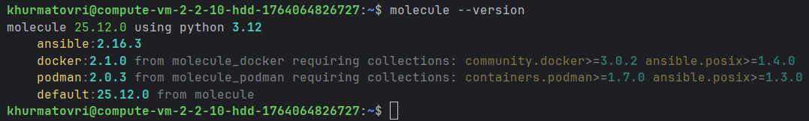
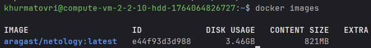
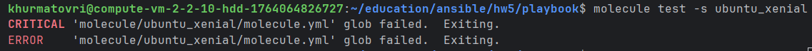
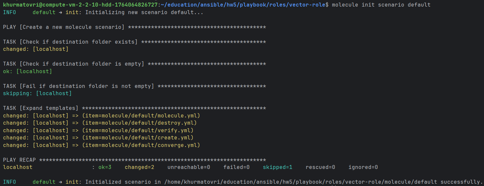
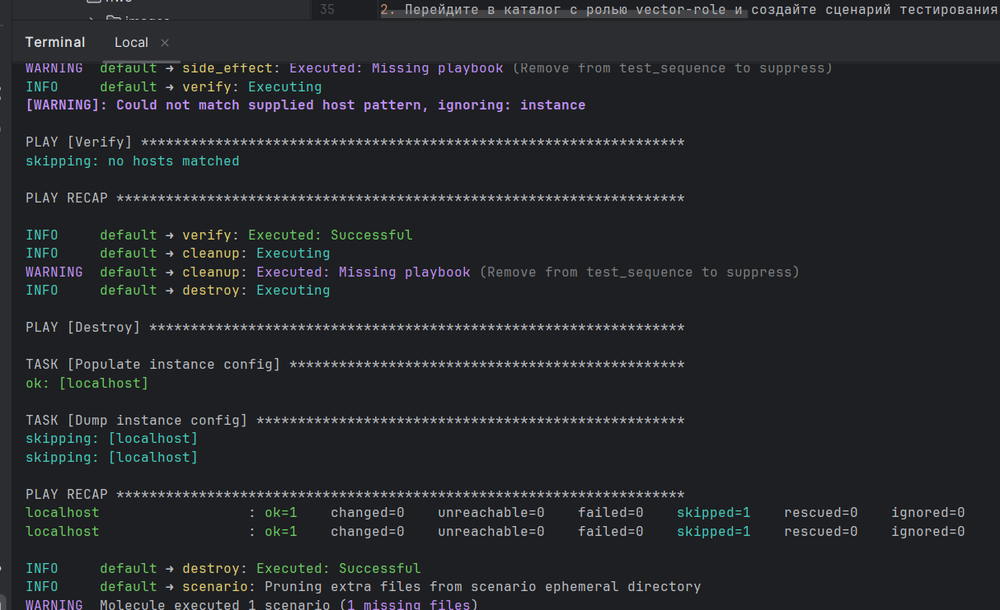
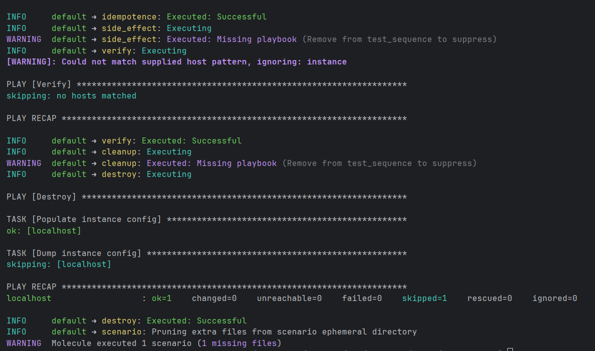

# Домашнее задание к занятию 5 «Тестирование roles»

## Подготовка к выполнению

1. Установите molecule и его драйвера: `pip3 install "molecule molecule_docker molecule_podman`.
2. Выполните `docker pull aragast/netology:latest` —  это образ с podman, tox и несколькими пайтонами (3.7 и 3.9) внутри.

## Подготовительные работы
1. Установите molecule и его драйвера: `pip3 install "molecule molecule_docker molecule_podman`.


2. Выполните `docker pull aragast/netology:latest` —  это образ с podman, tox и несколькими пайтонами (3.7 и 3.9) внутри. 


## Основная часть

Ваша цель — настроить тестирование ваших ролей.

Задача — сделать сценарии тестирования для vector.

Ожидаемый результат — все сценарии успешно проходят тестирование ролей.

### Molecule

1. Запустите  `molecule test -s ubuntu_xenial` (или с любым другим сценарием, не имеет значения) внутри корневой директории clickhouse-role, посмотрите на вывод команды. Данная команда может отработать с ошибками или не отработать вовсе, это нормально. Наша цель - посмотреть как другие в реальном мире используют молекулу И из чего может состоять сценарий тестирования.
2. Перейдите в каталог с ролью vector-role и создайте сценарий тестирования по умолчанию при помощи `molecule init scenario --driver-name docker`.
3. Добавьте несколько разных дистрибутивов (oraclelinux:8, ubuntu:latest) для инстансов и протестируйте роль, исправьте найденные ошибки, если они есть.
4. Добавьте несколько assert в verify.yml-файл для  проверки работоспособности vector-role (проверка, что конфиг валидный, проверка успешности запуска и др.).
5. Запустите тестирование роли повторно и проверьте, что оно прошло успешно.
5. Добавьте новый тег на коммит с рабочим сценарием в соответствии с семантическим версионированием.

### Выполнение для Molecule

1. Запустите  `molecule test -s ubuntu_xenial` (или с любым другим сценарием, не имеет значения) внутри корневой директории clickhouse-role, посмотрите на вывод команды. Данная команда может отработать с ошибками или не отработать вовсе, это нормально. Наша цель - посмотреть как другие в реальном мире используют молекулу И из чего может состоять сценарий тестирования.


2. Перейдите в каталог с ролью vector-role и создайте сценарий тестирования по умолчанию при помощи `molecule init scenario --driver-name docker`.


3. Добавьте несколько разных дистрибутивов (oraclelinux:8, ubuntu:latest) для инстансов и протестируйте роль, исправьте найденные ошибки, если они есть.
Тестирование будем делать на удаленных ВМ, созданных ранее для выполнения ДЗ.
```declarative
---
driver:
name: default

platforms:
- name: clickhouse-01
groups: [clickhouse, all]

- name: vector-01
groups: [vector, all]

- name: lighthouse-01
groups: [lighthouse, all]

provisioner:
name: ansible
inventory:
links:
hosts: /home/khurmatovri/education/ansible/hw5/playbook/inventory/prod.yml

verifier:
name: ansible

```
Исправили ошибки и протестировали роль:


4. Добавьте несколько assert в verify.yml-файл для проверки работоспособности vector-role (проверка, что конфиг валидный, проверка успешности запуска и др.).
```declarative
---
# Purpose: assert that the instance really ended up in the expected state.
# Molecule calls this playbook with `molecule verify`.
- name: Verify
  hosts: instance
  gather_facts: false # Quicker, if you do not need facts
  tasks:
    - name: Assert something
      ansible.builtin.assert:
        that: true

```
Протестировали роль после добавления:


5. Запустите тестирование роли повторно и проверьте, что оно прошло успешно.
```declarative
khurmatovri@compute-vm-2-2-10-hdd-1764064826727:~/education/ansible/hw5/playbook/roles/vector-role$ molecule test
INFO     default ➜ discovery: scenario test matrix: dependency, cleanup, destroy, syntax, create, prepare, converge, idempotence, side_effect, verify, cleanup, destroy
INFO     default ➜ prerun: Performing prerun with role_name_check=0...
INFO     default ➜ dependency: Executing
WARNING  default ➜ dependency: Missing roles requirements file: requirements.yml
WARNING  default ➜ dependency: Missing collections requirements file: collections.yml
WARNING  default ➜ dependency: Executed: 2 missing (Remove from test_sequence to suppress)
INFO     default ➜ cleanup: Executing
WARNING  default ➜ cleanup: Executed: Missing playbook (Remove from test_sequence to suppress)
INFO     default ➜ destroy: Executing

PLAY [Destroy] *****************************************************************

TASK [Populate instance config] ************************************************
ok: [localhost]

TASK [Dump instance config] ****************************************************
skipping: [localhost]

PLAY RECAP *********************************************************************
localhost                  : ok=1    changed=0    unreachable=0    failed=0    skipped=1    rescued=0    ignored=0

INFO     default ➜ destroy: Executed: Successful
INFO     default ➜ syntax: Executing

playbook: /home/khurmatovri/education/ansible/hw5/playbook/roles/vector-role/molecule/default/converge.yml
INFO     default ➜ syntax: Executed: Successful
INFO     default ➜ create: Executing

PLAY [Create] ******************************************************************

TASK [Populate instance config dict] *******************************************
skipping: [localhost]

TASK [Convert instance config dict to a list] **********************************
skipping: [localhost]

TASK [Dump instance config] ****************************************************
skipping: [localhost]

PLAY RECAP *********************************************************************
localhost                  : ok=0    changed=0    unreachable=0    failed=0    skipped=3    rescued=0    ignored=0

INFO     default ➜ create: Executed: Successful
INFO     default ➜ prepare: Executing                                                                                                                                        
WARNING  default ➜ prepare: Executed: Missing playbook (Remove from test_sequence to suppress)
INFO     default ➜ converge: Executing                                                                                                                                       

PLAY [Test Vector role] ********************************************************

TASK [Gathering Facts] *********************************************************
ok: [vector-01]

TASK [/home/khurmatovri/education/ansible/hw5/playbook/roles/vector-role : Create Vector directories] ***
ok: [vector-01] => (item=/opt/vector)
ok: [vector-01] => (item=/etc/vector)

TASK [/home/khurmatovri/education/ansible/hw5/playbook/roles/vector-role : Download Vector archive] ***
ok: [vector-01]

TASK [/home/khurmatovri/education/ansible/hw5/playbook/roles/vector-role : Extract Vector to installation directory] ***
ok: [vector-01]

TASK [/home/khurmatovri/education/ansible/hw5/playbook/roles/vector-role : Install Vector binary] ***
[WARNING]: Cannot set fs attributes on a non-existent symlink target. follow
should be set to False to avoid this.
ok: [vector-01]

TASK [/home/khurmatovri/education/ansible/hw5/playbook/roles/vector-role : Create Vector systemd service] ***
ok: [vector-01]

TASK [/home/khurmatovri/education/ansible/hw5/playbook/roles/vector-role : Deploy Vector configuration] ***
ok: [vector-01]

TASK [/home/khurmatovri/education/ansible/hw5/playbook/roles/vector-role : Enable and start Vector service] ***
ok: [vector-01]

PLAY RECAP *********************************************************************
vector-01                  : ok=8    changed=0    unreachable=0    failed=0    skipped=0    rescued=0    ignored=0

INFO     default ➜ converge: Executed: Successful
INFO     default ➜ idempotence: Executing                                                                                                                                    

PLAY [Test Vector role] ********************************************************

TASK [Gathering Facts] *********************************************************
ok: [vector-01]

TASK [/home/khurmatovri/education/ansible/hw5/playbook/roles/vector-role : Create Vector directories] ***
ok: [vector-01] => (item=/opt/vector)
ok: [vector-01] => (item=/etc/vector)

TASK [/home/khurmatovri/education/ansible/hw5/playbook/roles/vector-role : Download Vector archive] ***
ok: [vector-01]

TASK [/home/khurmatovri/education/ansible/hw5/playbook/roles/vector-role : Extract Vector to installation directory] ***
ok: [vector-01]

TASK [/home/khurmatovri/education/ansible/hw5/playbook/roles/vector-role : Install Vector binary] ***
[WARNING]: Cannot set fs attributes on a non-existent symlink target. follow
should be set to False to avoid this.
ok: [vector-01]

TASK [/home/khurmatovri/education/ansible/hw5/playbook/roles/vector-role : Create Vector systemd service] ***
ok: [vector-01]

TASK [/home/khurmatovri/education/ansible/hw5/playbook/roles/vector-role : Deploy Vector configuration] ***
ok: [vector-01]

TASK [/home/khurmatovri/education/ansible/hw5/playbook/roles/vector-role : Enable and start Vector service] ***
ok: [vector-01]

PLAY RECAP *********************************************************************
vector-01                  : ok=8    changed=0    unreachable=0    failed=0    skipped=0    rescued=0    ignored=0

INFO     default ➜ idempotence: Executed: Successful
INFO     default ➜ side_effect: Executing                                                                                                                                    
WARNING  default ➜ side_effect: Executed: Missing playbook (Remove from test_sequence to suppress)
INFO     default ➜ verify: Executing
[WARNING]: Could not match supplied host pattern, ignoring: instance

PLAY [Verify] ******************************************************************
skipping: no hosts matched

PLAY RECAP *********************************************************************

INFO     default ➜ verify: Executed: Successful
INFO     default ➜ cleanup: Executing                                                                                                                                        
WARNING  default ➜ cleanup: Executed: Missing playbook (Remove from test_sequence to suppress)
INFO     default ➜ destroy: Executing                                                                                                                                        

PLAY [Destroy] *****************************************************************

TASK [Populate instance config] ************************************************
ok: [localhost]

TASK [Dump instance config] ****************************************************
skipping: [localhost]

PLAY RECAP *********************************************************************
localhost                  : ok=1    changed=0    unreachable=0    failed=0    skipped=1    rescued=0    ignored=0

INFO     default ➜ destroy: Executed: Successful
INFO     default ➜ scenario: Pruning extra files from scenario ephemeral directory
WARNING  Molecule executed 1 scenario (1 missing files)
```

5. Добавьте новый тег на коммит с рабочим сценарием в соответствии с семантическим версионированием.
https://github.com/Khurmatov/vector-role/releases/tag/v1.1.0

### Tox

1. Добавьте в директорию с vector-role файлы из [директории](./example).
2. Запустите `docker run --privileged=True -v <path_to_repo>:/opt/vector-role -w /opt/vector-role -it aragast/netology:latest /bin/bash`, где path_to_repo — путь до корня репозитория с vector-role на вашей файловой системе.
3. Внутри контейнера выполните команду `tox`, посмотрите на вывод.
5. Создайте облегчённый сценарий для `molecule` с драйвером `molecule_podman`. Проверьте его на исполнимость.
6. Пропишите правильную команду в `tox.ini`, чтобы запускался облегчённый сценарий.
8. Запустите команду `tox`. Убедитесь, что всё отработало успешно.
9. Добавьте новый тег на коммит с рабочим сценарием в соответствии с семантическим версионированием.

После выполнения у вас должно получится два сценария molecule и один tox.ini файл в репозитории. Не забудьте указать в ответе теги решений Tox и Molecule заданий. В качестве решения пришлите ссылку на  ваш репозиторий и скриншоты этапов выполнения задания.

## Необязательная часть

1. Проделайте схожие манипуляции для создания роли LightHouse.
2. Создайте сценарий внутри любой из своих ролей, который умеет поднимать весь стек при помощи всех ролей.
3. Убедитесь в работоспособности своего стека. Создайте отдельный verify.yml, который будет проверять работоспособность интеграции всех инструментов между ними.
4. Выложите свои roles в репозитории.

В качестве решения пришлите ссылки и скриншоты этапов выполнения задания.

---

### Как оформить решение задания

Выполненное домашнее задание пришлите в виде ссылки на .md-файл в вашем репозитории.
