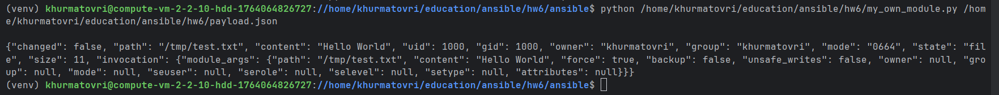
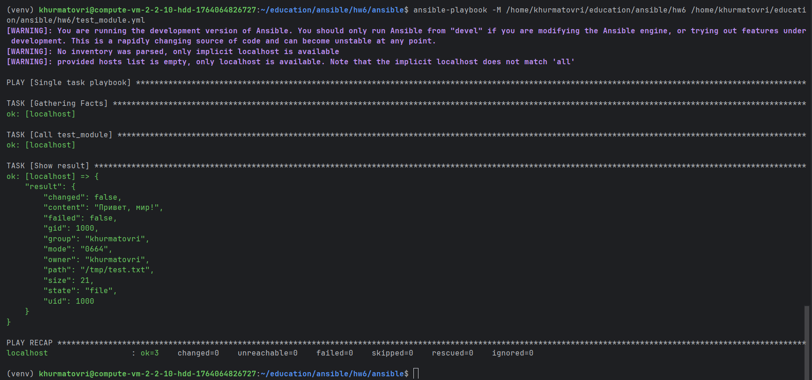
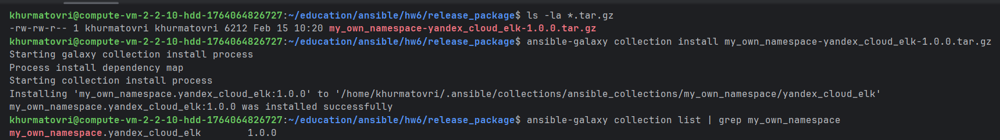
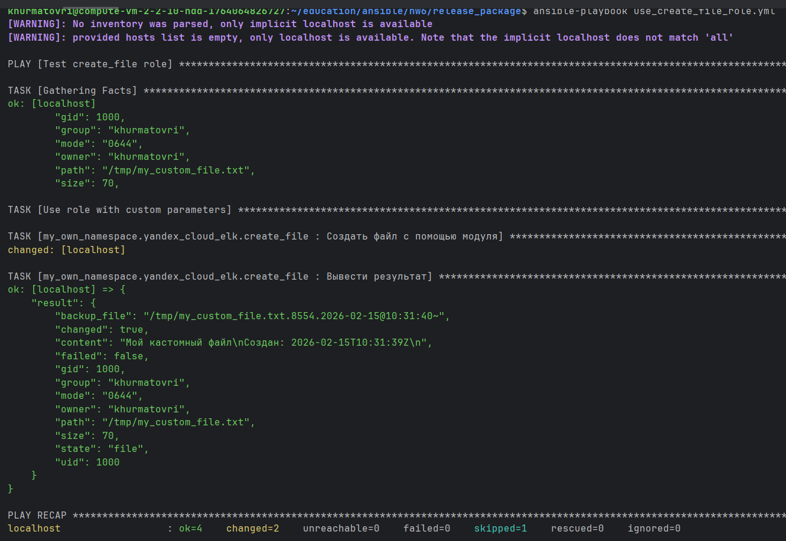

## Ответы

**Шаг 4.** Проверьте module на исполняемость локально.

**Шаг 6.** Проверьте через playbook на идемпотентность.

**Шаг 15.** Установите collection из локального архива: `ansible-galaxy collection install <archivename>.tar.gz`.

**Шаг 16.** Запустите playbook, убедитесь, что он работает.

Ссылка на collection: https://github.com/Khurmatov/my_own_collection/tree/main/yandex_cloud_elk
Ссылка на tar.gz архив: https://github.com/Khurmatov/my_own_collection/blob/main/release_package/my_own_namespace-yandex_cloud_elk-1.0.0.tar.gz