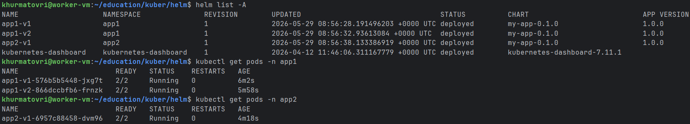
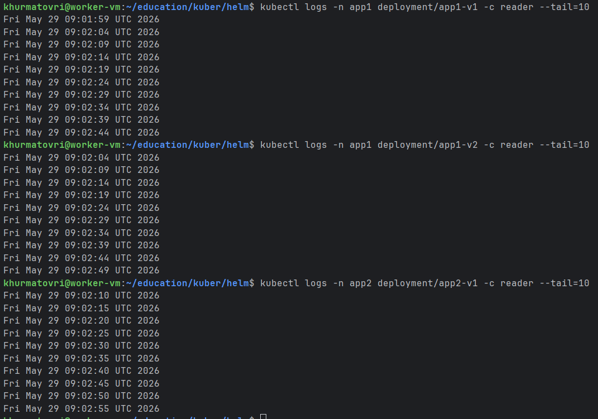

# Домашнее задание к занятию «Helm»

### Цель задания

В тестовой среде Kubernetes необходимо установить и обновить приложения с помощью Helm.

------

### Чеклист готовности к домашнему заданию

1. Установленное k8s-решение, например, MicroK8S.
2. Установленный локальный kubectl.
3. Установленный локальный Helm.
4. Редактор YAML-файлов с подключенным репозиторием GitHub.

------

### Инструменты и дополнительные материалы, которые пригодятся для выполнения задания

1. [Инструкция](https://helm.sh/docs/intro/install/) по установке Helm. [Helm completion](https://helm.sh/docs/helm/helm_completion/).

------

### Задание 1. Подготовить Helm-чарт для приложения

1. Необходимо упаковать приложение в чарт для деплоя в разные окружения.
2. Каждый компонент приложения деплоится отдельным deployment’ом или statefulset’ом.
3. В переменных чарта измените образ приложения для изменения версии.

------
### Задание 2. Запустить две версии в разных неймспейсах

1. Подготовив чарт, необходимо его проверить. Запуститe несколько копий приложения.
2. Одну версию в namespace=app1, вторую версию в том же неймспейсе, третью версию в namespace=app2.
3. Продемонстрируйте результат.

### Правила приёма работы

1. Домашняя работа оформляется в своём Git репозитории в файле README.md. Выполненное домашнее задание пришлите ссылкой на .md-файл в вашем репозитории.
2. Файл README.md должен содержать скриншоты вывода необходимых команд `kubectl`, `helm`, а также скриншоты результатов.
3. Репозиторий должен содержать тексты манифестов или ссылки на них в файле README.md.

Ответы:
```declarative
apiVersion: apps/v1
kind: Deployment
metadata:
  name: {{ .Values.name }}
  labels:
    app: {{ .Values.name }}
spec:
  replicas: 1
  selector:
    matchLabels:
      app: {{ .Values.name }}
  template:
    metadata:
      labels:
        app: {{ .Values.name }}
    spec:
      containers:
      - name: writer
        image: "{{ .Values.writer.image.repository }}:{{ .Values.writer.image.tag }}"
        command: ["/bin/sh", "-c"]
        args: ["while true; do echo $(date) >> /shared/data.txt; sleep 5; done"]
        volumeMounts:
        - name: shared-storage
          mountPath: /shared
      - name: reader
        image: "{{ .Values.reader.image.repository }}:{{ .Values.reader.image.tag }}"
        command: ["/bin/sh", "-c"]
        args: ["tail -f /shared/data.txt"]
        volumeMounts:
        - name: shared-storage
          mountPath: /shared
      volumes:
      - name: shared-storage
        emptyDir: {}

```

```declarative
apiVersion: v2
name: my-app
description: Application with two containers
type: application
version: 0.1.0
appVersion: "1.0.0"

```

```declarative
name: my-app

writer:
  image:
    repository: busybox
    tag: latest

reader:
  image:
    repository: wbitt/network-multitool
    tag: latest

```


