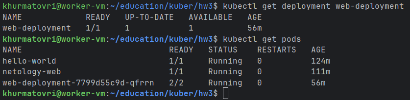
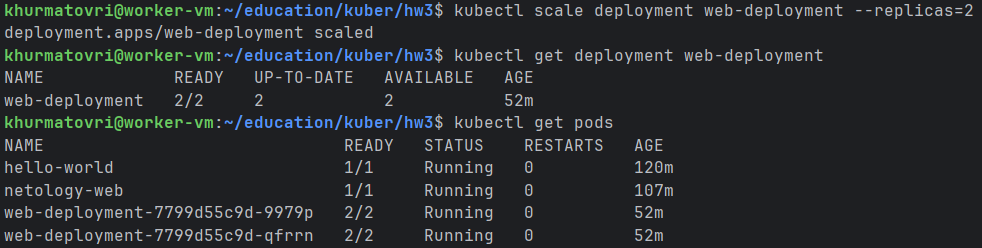
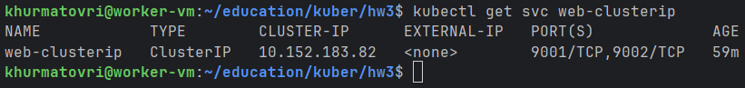
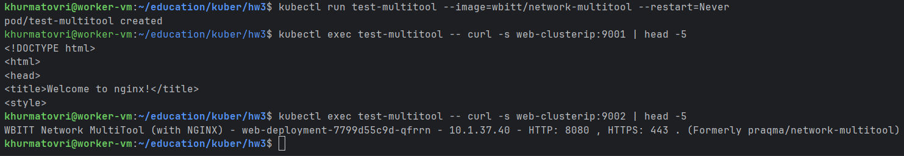

# Домашнее задание к занятию «Запуск приложений в K8S»

### Цель задания

В тестовой среде для работы с Kubernetes, установленной в предыдущем ДЗ, необходимо развернуть Deployment с приложением, состоящим из нескольких контейнеров, и масштабировать его.

------

### Чеклист готовности к домашнему заданию

1. Установленное k8s-решение (например, MicroK8S).
2. Установленный локальный kubectl.
3. Редактор YAML-файлов с подключённым git-репозиторием.

------

### Инструменты и дополнительные материалы, которые пригодятся для выполнения задания

1. [Описание](https://kubernetes.io/docs/concepts/workloads/controllers/deployment/) Deployment и примеры манифестов.
2. [Описание](https://kubernetes.io/docs/concepts/workloads/pods/init-containers/) Init-контейнеров.
3. [Описание](https://github.com/wbitt/Network-MultiTool) Multitool.

------

### Задание 1. Создать Deployment и обеспечить доступ к репликам приложения из другого Pod

1. Создать Deployment приложения, состоящего из двух контейнеров — nginx и multitool. Решить возникшую ошибку.
```declarative
apiVersion: apps/v1
kind: Deployment
metadata:
  name: web-deployment
  labels:
    app: web-app
spec:
  replicas: 1
  selector:
    matchLabels:
      app: web-app
  template:
    metadata:
      labels:
        app: web-app
    spec:
      containers:
      - name: nginx
        image: nginx:latest
        ports:
        - containerPort: 80
          name: nginx-port
        resources:
          limits:
            memory: "128Mi"
            cpu: "100m"
      
      - name: multitool
        image: wbitt/network-multitool
        ports:
        - containerPort: 8080
          name: multitool-port
        env:
        - name: HTTP_PORT
          value: "8080"
        resources:
          limits:
            memory: "128Mi"
            cpu: "100m"

```



2. После запуска увеличить количество реплик работающего приложения до 2.


3. Продемонстрировать количество подов до и после масштабирования.
В пунктах 1 и 2

4. Создать Service, который обеспечит доступ до реплик приложений из п.1.
```declarative
apiVersion: v1
kind: Service
metadata:
  name: web-clusterip
spec:
  type: ClusterIP
  selector:
    app: web-app
  ports:
  - name: nginx-port
    protocol: TCP
    port: 9001
    targetPort: 80
  - name: multitool-port
    protocol: TCP
    port: 9002
    targetPort: 8080

```


5. Создать отдельный Pod с приложением multitool и убедиться с помощью `curl`, что из пода есть доступ до приложений из п.1.


------

### Задание 2. Создать Deployment и обеспечить старт основного контейнера при выполнении условий

1. Создать Deployment приложения nginx и обеспечить старт контейнера только после того, как будет запущен сервис этого приложения.
2. Убедиться, что nginx не стартует. В качестве Init-контейнера взять busybox.
3. Создать и запустить Service. Убедиться, что Init запустился.
4. Продемонстрировать состояние пода до и после запуска сервиса.

------

### Правила приема работы

1. Домашняя работа оформляется в своем Git-репозитории в файле README.md. Выполненное домашнее задание пришлите ссылкой на .md-файл в вашем репозитории.
2. Файл README.md должен содержать скриншоты вывода необходимых команд `kubectl` и скриншоты результатов.
3. Репозиторий должен содержать файлы манифестов и ссылки на них в файле README.md.

------
