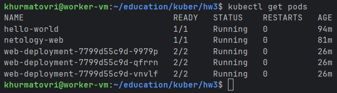
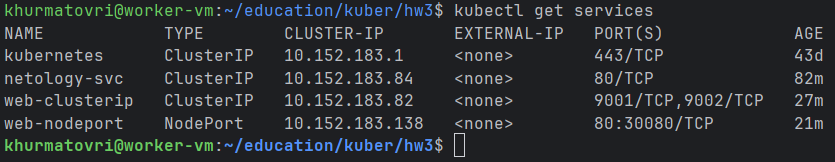
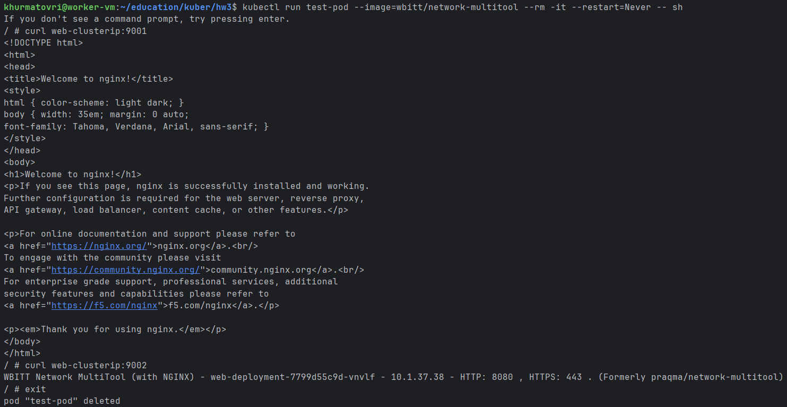
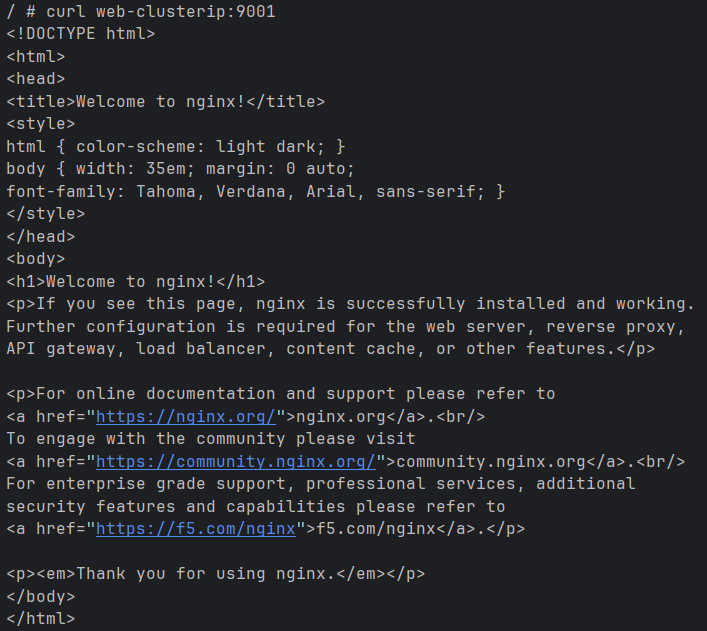
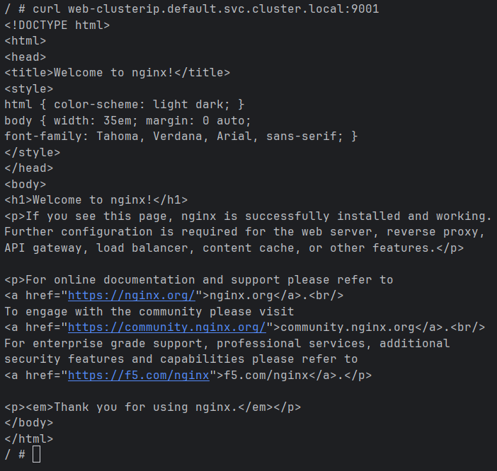
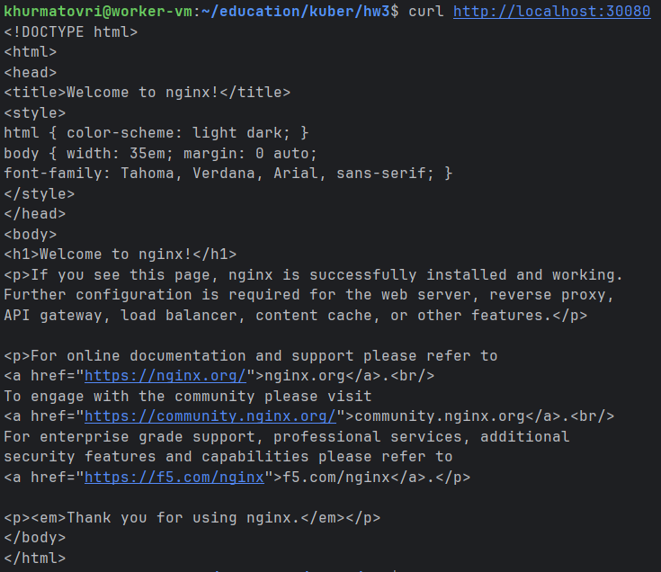
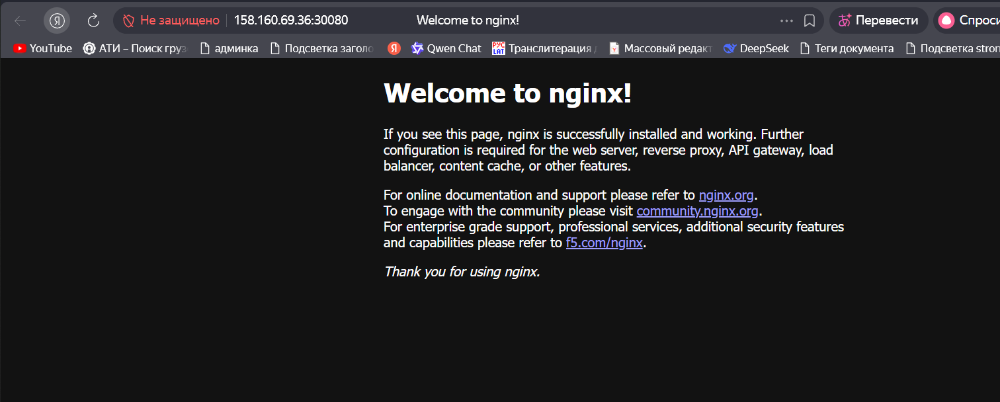

# Домашнее задание к занятию «Сетевое взаимодействие в K8S. Часть 1»

### Цель задания

В тестовой среде Kubernetes необходимо обеспечить доступ к приложению, установленному в предыдущем ДЗ и состоящему из двух контейнеров, по разным портам в разные контейнеры как внутри кластера, так и снаружи.

------

### Чеклист готовности к домашнему заданию

1. Установленное k8s-решение (например, MicroK8S).
2. Установленный локальный kubectl.
3. Редактор YAML-файлов с подключённым Git-репозиторием.

------

### Инструменты и дополнительные материалы, которые пригодятся для выполнения задания

1. [Описание](https://kubernetes.io/docs/concepts/workloads/controllers/deployment/) Deployment и примеры манифестов.
2. [Описание](https://kubernetes.io/docs/concepts/services-networking/service/) Описание Service.
3. [Описание](https://github.com/wbitt/Network-MultiTool) Multitool.

------

### Задание 1. Создать Deployment и обеспечить доступ к контейнерам приложения по разным портам из другого Pod внутри кластера

1. Создать Deployment приложения, состоящего из двух контейнеров (nginx и multitool), с количеством реплик 3 шт.
```declarative
apiVersion: apps/v1
kind: Deployment
metadata:
  name: web-deployment
  labels:
    app: web-app
spec:
  replicas: 3
  selector:
    matchLabels:
      app: web-app
  template:
    metadata:
      labels:
        app: web-app
    spec:
      containers:
      - name: nginx
        image: nginx:latest
        ports:
        - containerPort: 80
          name: nginx-port
        resources:
          limits:
            memory: "128Mi"
            cpu: "100m"
      
      - name: multitool
        image: wbitt/network-multitool
        ports:
        - containerPort: 8080
          name: multitool-port
        env:
        - name: HTTP_PORT
          value: "8080"
        resources:
          limits:
            memory: "128Mi"
            cpu: "100m"

```


2. Создать Service, который обеспечит доступ внутри кластера до контейнеров приложения из п.1 по порту 9001 — nginx 80, по 9002 — multitool 8080.
```declarative
apiVersion: v1
kind: Service
metadata:
  name: web-clusterip
spec:
  type: ClusterIP
  selector:
    app: web-app
  ports:
  - name: nginx-port
    protocol: TCP
    port: 9001
    targetPort: 80
  - name: multitool-port
    protocol: TCP
    port: 9002
    targetPort: 8080

```


3. Создать отдельный Pod с приложением multitool и убедиться с помощью `curl`, что из пода есть доступ до приложения из п.1 по разным портам в разные контейнеры.


4. Продемонстрировать доступ с помощью `curl` по доменному имени сервиса.



5. Предоставить манифесты Deployment и Service в решении, а также скриншоты или вывод команды п.4.
В пунктах 1 и 2
------

### Задание 2. Создать Service и обеспечить доступ к приложениям снаружи кластера

1. Создать отдельный Service приложения из Задания 1 с возможностью доступа снаружи кластера к nginx, используя тип NodePort.
```declarative
apiVersion: v1
kind: Service
metadata:
  name: web-nodeport
spec:
  type: NodePort
  selector:
    app: web-app
  ports:
  - name: nginx-port
    protocol: TCP
    port: 80
    targetPort: 80
    nodePort: 30080
```

2. Продемонстрировать доступ с помощью браузера или `curl` с локального компьютера.



3. Предоставить манифест и Service в решении, а также скриншоты или вывод команды п.2.
В пунктах 1 и 2
------

### Правила приёма работы

1. Домашняя работа оформляется в своем Git-репозитории в файле README.md. Выполненное домашнее задание пришлите ссылкой на .md-файл в вашем репозитории.
2. Файл README.md должен содержать скриншоты вывода необходимых команд `kubectl` и скриншоты результатов.
3. Репозиторий должен содержать тексты манифестов или ссылки на них в файле README.md.

