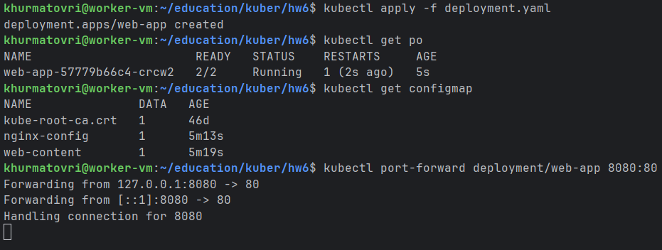
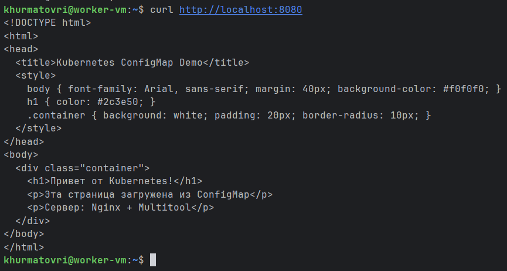
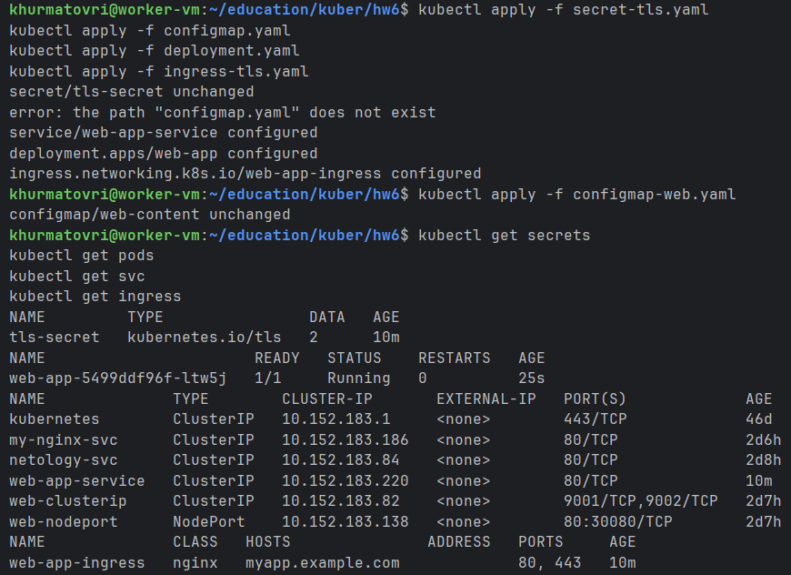
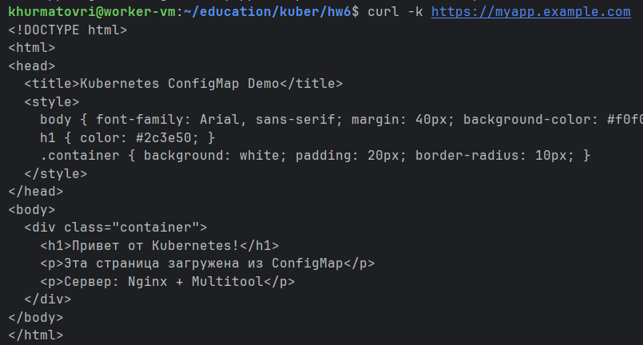
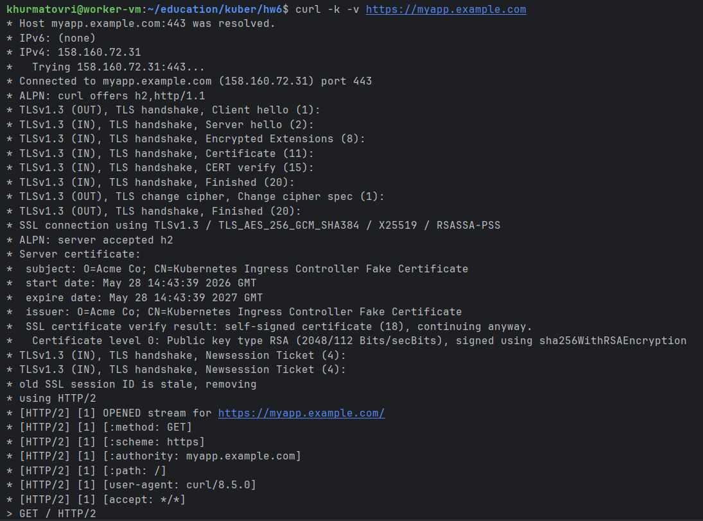
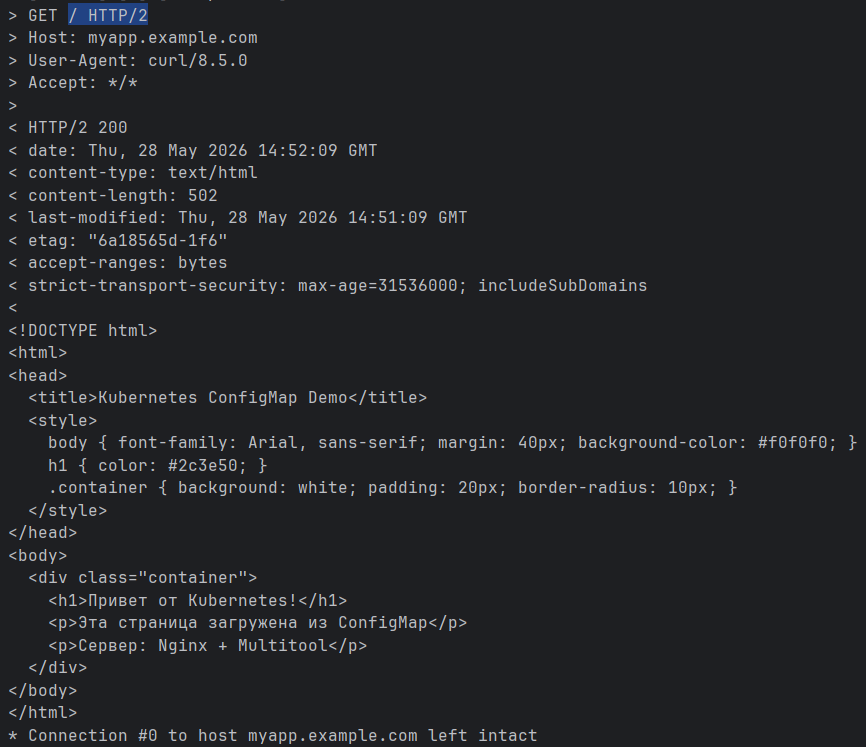
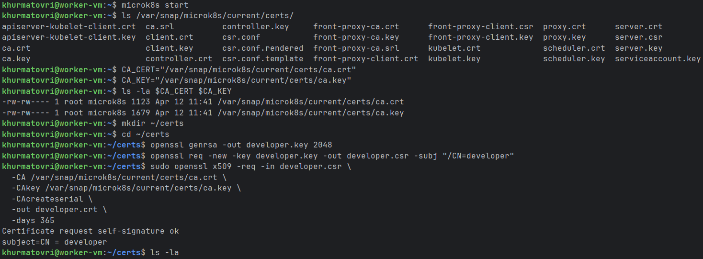
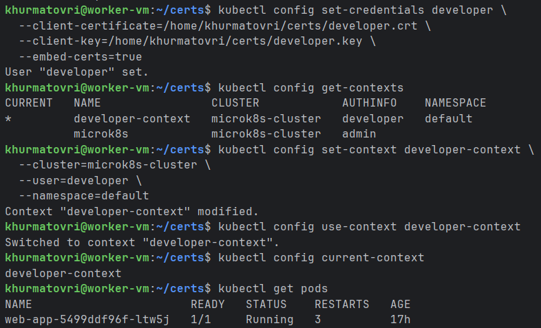
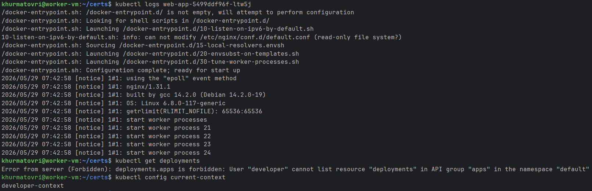
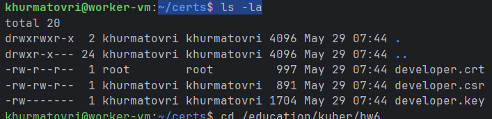

# Домашнее задание к занятию «Настройка приложений и управление доступом в Kubernetes»

### Примерное время выполнения задания

120 минут

### Цель задания

Научиться:
- Настраивать конфигурацию приложений с помощью **ConfigMaps** и **Secrets**
- Управлять доступом пользователей через **RBAC**

Это задание поможет вам освоить ключевые механизмы Kubernetes для работы с конфигурацией и безопасностью. Эти навыки необходимы для уверенного администрирования кластеров в реальных проектах. На практике навыки используются для:
- Хранения чувствительных данных (Secrets)
- Гибкого управления настройками приложений (ConfigMaps)
- Контроля доступа пользователей и сервисов (RBAC)

------

## **Подготовка**
### **Чеклист готовности**
- Установлен Kubernetes (MicroK8S, Minikube или другой)
- Установлен `kubectl`
- Редактор для YAML-файлов (VS Code, Vim и др.)
- Утилита `openssl` для генерации сертификатов

------

### Инструменты, которые пригодятся для выполнения задания

1. [Инструкция](https://microk8s.io/docs/getting-started) по установке MicroK8S
2. [Инструкция](https://minikube.sigs.k8s.io/docs/start/) по установке Minikube
3. [Инструкция](https://kubernetes.io/docs/tasks/tools/) по установке kubectl
4. [Инструкция](https://marketplace.visualstudio.com/items?itemName=ms-kubernetes-tools.vscode-kubernetes-tools) по установке VS Code

### Дополнительные материалы, которые пригодятся для выполнения задания

1. [Описание](https://kubernetes.io/docs/concepts/configuration/secret/) Secret.
2. [Описание](https://kubernetes.io/docs/concepts/configuration/configmap/) ConfigMap.
3. [Описание](https://github.com/wbitt/Network-MultiTool) Multitool.
4. [Описание](https://kubernetes.io/docs/reference/access-authn-authz/rbac/) RBAC.
5. [Пользователи и авторизация RBAC в Kubernetes](https://habr.com/ru/company/flant/blog/470503/).
6. [RBAC with Kubernetes in Minikube](https://medium.com/@HoussemDellai/rbac-with-kubernetes-in-minikube-4deed658ea7b).

------

## **Задание 1: Работа с ConfigMaps**
### **Задача**
Развернуть приложение (nginx + multitool), решить проблему конфигурации через ConfigMap и подключить веб-страницу.

### **Шаги выполнения**
1. **Создать Deployment** с двумя контейнерами
  - `nginx`
  - `multitool`
3. **Подключить веб-страницу** через ConfigMap
4. **Проверить доступность**

### **Что сдать на проверку**
- Манифесты:
  - `deployment.yaml`
  - `configmap-web.yaml`
- Скриншот вывода `curl` или браузера

Ответ:
```declarative
apiVersion: v1
kind: Service
metadata:
  name: web-app-service
  namespace: default
spec:
  selector:
    app: web-app
  ports:
    - port: 80
      targetPort: 80
      protocol: TCP
  type: ClusterIP
---
apiVersion: apps/v1
kind: Deployment
metadata:
  name: web-app
  namespace: default
spec:
  replicas: 1
  selector:
    matchLabels:
      app: web-app
  template:
    metadata:
      labels:
        app: web-app
    spec:
      containers:
        - name: nginx
          image: nginx:latest
          ports:
            - containerPort: 80
          volumeMounts:
            - name: web-content
              mountPath: /usr/share/nginx/html
            - name: nginx-config
              mountPath: /etc/nginx/conf.d
      volumes:
        - name: web-content
          configMap:
            name: web-content
        - name: nginx-config
          configMap:
            name: nginx-config
```

```declarative
apiVersion: v1
kind: ConfigMap
metadata:
  name: web-content
  namespace: default
data:
  index.html: |
    <!DOCTYPE html>
    <html>
    <head>
      <title>Kubernetes ConfigMap Demo</title>
      <style>
        body { font-family: Arial, sans-serif; margin: 40px; background-color: #f0f0f0; }
        h1 { color: #2c3e50; }
        .container { background: white; padding: 20px; border-radius: 10px; }
      </style>
    </head>
    <body>
      <div class="container">
        <h1>Привет от Kubernetes!</h1>
        <p>Эта страница загружена из ConfigMap</p>
        <p>Сервер: Nginx + Multitool</p>
      </div>
    </body>
    </html>
```




---
## **Задание 2: Настройка HTTPS с Secrets**
### **Задача**
Развернуть приложение с доступом по HTTPS, используя самоподписанный сертификат.

### **Шаги выполнения**
1. **Сгенерировать SSL-сертификат**
```bash
openssl req -x509 -nodes -days 365 -newkey rsa:2048 \
  -keyout tls.key -out tls.crt -subj "/CN=myapp.example.com"
```
2. **Создать Secret**
3. **Настроить Ingress**
4. **Проверить HTTPS-доступ**

### **Что сдать на проверку**
- Манифесты:
  - `secret-tls.yaml`
  - `ingress-tls.yaml`
- Скриншот вывода `curl -k`

Ответ:
```declarative
apiVersion: v1
kind: Secret
metadata:
  name: tls-secret
  namespace: default
type: kubernetes.io/tls
data:
  tls.crt: LS0tLS1CRUdJTiBDRVJUSUZJQ0FURS0tLS0tCk1JSURHVENDQWdHZ0F3SUJBZ0lVSlNNdXkrdG5Ta1JVZmJJU2M4Z1hTR0pXQ0pFd0RRWUpLb1pJaHZjTkFRRUwKQlFBd0hERWFNQmdHRTFVek5ESTBXaGNOTWpjd05USTRNVFF6TkRJMFdqQWNNUm93R0FZRFZRUUREQkZ0ZVdGd2NDNWxlR0Z0Y0d4bExtTnZiVENDCkFTSXdEUVlKS29aSWh2Y05BUUVCQlFBRGdnRVBBRENDQVFvQ2dnRUJBSjJoeWU4ZE96MjRyZ2oxeVJOd2h2Z1oKNVhJM0ZweHUvdkhLbjNuTlAyRmZnVVBWQS9MTlZzMFdvR0ZlME02d0VsVzBDCkF3RUFBYU5UTUZFd0hRWURWUjBPQkJZRUZBSWplZmUyY3JCTzF0dmY2eG1WVE45bmp3SWxNQjhHQTFVZEl3UVkKTUJhQUZBSWplZmUyY3JCTzF0dmY2eG1WVE45bmp3SWxNQThHQTFVZEV3RUIvd1FGTUFNQkFmOHdEUVlKS29aSQpodmNOQVFFTEJRQURnZ0VCQUNubkFDNWtzVi9mZDBGREQ5QVZQL0VNMGtxY1N4L3MKZDBhWk1ubXFIZlZ3MHgxRjNlZkY5TVp2S2xWRGdiTTBNRURIUklNPQotLS0tLUVORCBDRVJUSUZJQ0FURS0tLS0tCg==
  tls.key: LS0tLS1CRUdJTiBQUklWQVRFIEtFWS0tLS0tCk1JSUV2UUlCQURBTkJna3Foa2lHOXcwQkFRRUZBQVNDQktjd2dnU2pBZ0VBQW9JQkFRQ2RvY252SFRzOXVLNEkKOWNrVGNJYjRHZVZ5TnhhY2J2N3hxdi8wZzhmaFhZaWxTMXJ3VjNtTzVpamxJdEVtQXF3ejBkVUl6L1ljT0R5aDNFSzVlM1c4T1pNSXp3S2VnZXNTMmw5L1oxNWhpajlaQWpCeWVjaFhaVXBsQ3huMjlodlR0VVRnS1JQOC9mbkxwbHJVNFYvMkpFbzJKVURaVWtzR1g1M1hQb1NGTnhBaXJuclFMRUgKekZVMEU4RXpEdUNVMVc1dGs5WmlnSWVBalorOEh2QXhUNDFqOWlLZ3BPNm1Ib0Z1MkJSWjROWlpOa0lXa0RtUwpTWVNiUUFjT1pHVkk2L0RQMVorMVp6RCszdllnSzVDcUowaE9tY1Q5YndLQmdRRGFRTVFNQTBWdjYyZ0Zrb1p4CjZZMlp6bE9xd1k3U1N0QzZCRVBUWHU5RUYyMEl5Y1FjU2ZlVVdMTlp4Z3MxbFFvRGN1ZStrRFVtck9QTFZYakgKM0dMTWFnWmhISncyK3hIelRSdUZhaTUzU2ptbUs1SG9pZ3BaaWVmOHpRdDJSbjJTRHptWklaMTVBK0plbFZmdgpyYXVkVjhqL3VPVEY4WmF2dkU3WDhwZFRSd0tCZ1FDNDVRRkhZZFRVTU5xSlVDRDdwa3I1dGJoSkhHVmp4bnFrCm9mdE5idGtvN21SNFFNTHFqYzU5bXR6UDhyTEpWM2NaZThNKzhKYWlhdWJYd3FWZVhBOWFvZTlGc1VGb1l6TE8KRVN4aFJybURha1VBMlg1dWhwU0puMXdZV0xJeENJZ3NYZXRvcVFUTEhEN3VTdXRGWWwzUEJGV3dJWFRJVHIxMwowNm9pbVNqanF3S0JnRjNMdWJWRDdxS0RzOGU1U2VoSXJCOHVpY3gzdEs1eGtyUnV3c3RqSUViT0hvREpYV3VlCjZqU3B6aUpGdDJtR3JMQUF3TkduM2YvS0MzZkdPc3NCenIvMHpOc05WYUZYVTBhUm04TkJkOGl5Y0lZV2NYVlQKWmRGSE1CajM4Zllab3p1VEtYakM5bzhjZVR1V3lSenJNVGJFbEZBNklLOWsvUkozUmhjT1hiUmZBb0dCQUpLQQpJYnRGc1RWUVlGaGN2VVdvUmRBR1JMYnBZUXpsdjFlallWUEJlU0FOaEY0a01rMVhmejNXN3c5MTVtUFNnZlFYCk5HVXlqS2kwdTZSSi9tMzkwOHlrY3NwdDRMMnRuQnZiVDZia095bjlraDlTTmZPdGZ4UnN5TFFoMDA4MnkyOGMKRytNWnlVcUdYdmJCTmhvTUR2aHhIdFFvTGpobzY0ZCtsMWhDc3p0eEFvR0FMbUNsbE83OVVPa3J3RU9tNThBNgp6bjhwZzJ3cW1oQ0tDVG82MWhRZHlvV3hsb0VFdEtUM3IwaGtBbEdRVnlENG1RWGE2QzhzMXUvaXpTWGpTOFNXCnVTL1QrRndraG0zNksyNUgxSFE5YnNZSkRQVVoyNG1pdm45dnRzUW10NDVrVnFqaGFtS0QwRlhPMW5iUkplcDYKWnRDSkx0NHBlbHpnWVBGU0VUZ3BFV2c9Ci0tLS0tRU5EIFBSSVZBVEUgS0VZLS0tLS0K
```

```declarative
apiVersion: networking.k8s.io/v1
kind: Ingress
metadata:
  name: web-app-ingress
  namespace: default
  annotations:
    # Для ingress-nginx controller
    nginx.ingress.kubernetes.io/ssl-redirect: "true"
    nginx.ingress.kubernetes.io/backend-protocol: "HTTP"
spec:
  ingressClassName: nginx  # Добавьте, если используете ingress-nginx
  tls:
    - hosts:
        - myapp.example.com
      secretName: tls-secret
  rules:
    - host: myapp.example.com
      http:
        paths:
          - path: /
            pathType: Prefix
            backend:
              service:
                name: web-app-service
                port:
                  number: 80
```






---
## **Задание 3: Настройка RBAC**
### **Задача**
Создать пользователя с ограниченными правами (только просмотр логов и описания подов).

### **Шаги выполнения**
1. **Включите RBAC в microk8s**
```bash
microk8s enable rbac
```
2. **Создать SSL-сертификат для пользователя**
```bash
openssl genrsa -out developer.key 2048
openssl req -new -key developer.key -out developer.csr -subj "/CN={ИМЯ ПОЛЬЗОВАТЕЛЯ}"
openssl x509 -req -in developer.csr -CA {CA серт вашего кластера} -CAkey {CA ключ вашего кластера} -CAcreateserial -out developer.crt -days 365
```
3. **Создать Role (только просмотр логов и описания подов) и RoleBinding**
4. **Проверить доступ**

### **Что сдать на проверку**
- Манифесты:
  - `role-pod-reader.yaml`
  - `rolebinding-developer.yaml`
- Команды генерации сертификатов
- Скриншот проверки прав (`kubectl get pods --as=developer`)

Ответ:
```declarative
apiVersion: rbac.authorization.k8s.io/v1
kind: Role
metadata:
  name: pod-reader
  namespace: default
rules:
- apiGroups: [""]
  resources:
    - pods
    - pods/log
  verbs:
    - get
    - list
    - watch

```

```declarative
apiVersion: rbac.authorization.k8s.io/v1
kind: RoleBinding
metadata:
  name: developer-pod-reader-binding
  namespace: default
subjects:
- kind: User
  name: developer
  apiGroup: rbac.authorization.k8s.io
roleRef:
  kind: Role
  name: pod-reader
  apiGroup: rbac.authorization.k8s.io

```






---
## Шаблоны манифестов с учебными комментариями
### **1. Deployment с ConfigMap (nginx + multitool)**
```yaml
apiVersion: apps/v1
kind: Deployment
metadata:
  name: web-app
spec:
  replicas: 1
  selector:
    matchLabels:
      app: web-app
  template:
    metadata:
      labels:
        app: web-app
    spec:
      containers:
      - name: nginx
        image: nginx:latest
        ports:
        - containerPort: 80
        volumeMounts:
        - name: nginx-config # ПОДКЛЮЧЕНИЕ ConfigMap
          mountPath: /etc/nginx/conf.d
      volumes:
      - name: nginx-config
        configMap:
          name: nginx-config # УКАЖИТЕ имя созданного ConfigMap
```
### **2. ConfigMap для веб-страницы**
```yaml
apiVersion: v1
kind: ConfigMap
metadata:
  name: web-content # ИЗМЕНИТЕ: Укажите имя ConfigMap
  namespace: default # ОПЦИОНАЛЬНО: Укажите namespace, если не default
data:
  # КЛЮЧЕВОЙ МОМЕНТ: index.html будет подключен как файл
  index.html: |
    <!DOCTYPE html>
    <html>
    <head>
      <title>Страница из ConfigMap</title> # ИЗМЕНИТЕ: Заголовок страницы
    </head>
    <body>
      <h1>Привет от Kubernetes!</h1> # ДОБАВЬТЕ: Свой контент страницы
    </body>
    </html>
```

### **3. Secret для TLS-сертификата**
```yaml
apiVersion: v1
kind: Secret
metadata:
  name: tls-secret # ИЗМЕНИТЕ при необходимости
type: kubernetes.io/tls
data:
  tls.crt: # ЗАМЕНИТЕ на base64-код сертификата (cat tls.crt | base64 -w 0)
  tls.key: # ЗАМЕНИТЕ на base64-код ключа (cat tls.key | base64 -w 0)
```
### **4. Role для просмотра подов**
```yaml
apiVersion: rbac.authorization.k8s.io/v1
kind: Role
metadata:
  name: pod-viewer # ИЗМЕНИТЕ: Название роли
  namespace: default # ВАЖНО: Role работает только в указанном namespace
rules:
- apiGroups: [""] # КЛЮЧЕВОЙ МОМЕНТ: "" означает core API group
  resources: # РАЗРЕШЕННЫЕ РЕСУРСЫ:
    - pods # Доступ к просмотру подов
    - pods/log # Доступ к логам подов
  verbs: # РАЗРЕШЕННЫЕ ДЕЙСТВИЯ:
    - get # Просмотр отдельных подов
    - list # Список всех подов
    - watch # Мониторинг изменений
    - describe # Просмотр деталей
# ДОПОЛНИТЕЛЬНО: Можно добавить больше правил для других ресурсов
```
---

## **Правила приёма работы**
1. Домашняя работа оформляется в своём Git-репозитории в файле README.md. Выполненное домашнее задание пришлите ссылкой на .md-файл в вашем репозитории.
2. Файл README.md должен содержать:
  - Скриншоты вывода команд `kubectl`
  - Скриншоты результатов выполнения
  - Тексты манифестов или ссылки на них
3. Для заданий с TLS приложите команды генерации сертификатов

## **Критерии оценивания задания**
1. Зачёт: Все задачи выполнены, манифесты корректны, есть доказательства работы (скриншоты).
2. Доработка (на доработку задание направляется 1 раз): основные задачи выполнены, при этом есть ошибки в манифестах или отсутствуют проверочные скриншоты.
3. Незачёт: работа выполнена не в полном объёме, есть ошибки в манифестах, отсутствуют проверочные скриншоты. Все попытки доработки израсходованы (на доработку работа направляется 1 раз). Этот вид оценки используется крайне редко.

## **Срок выполнения задания**
1. 5 дней на выполнение задания.
2. 5 дней на доработку задания (в случае направления задания на доработку).