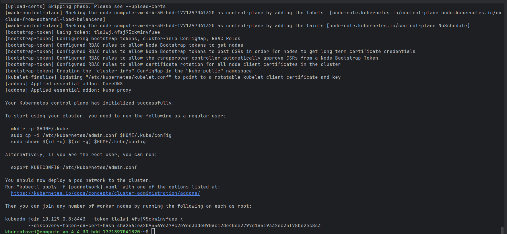
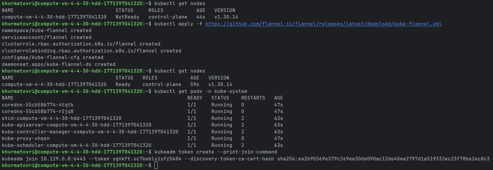
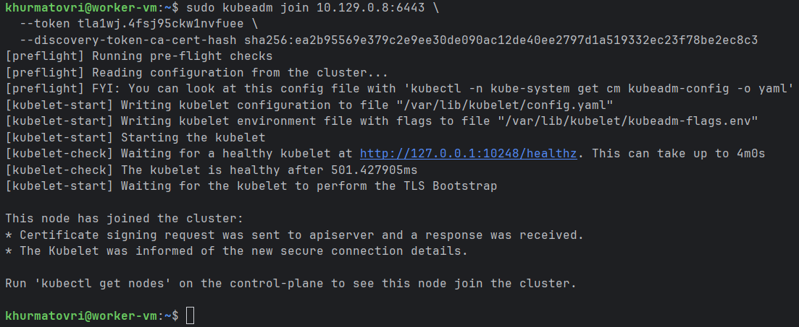
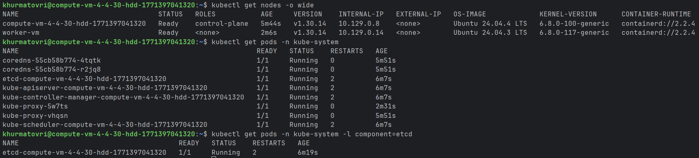
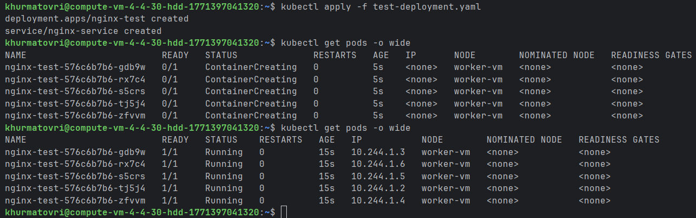

# Домашнее задание к занятию «Установка Kubernetes»

### Цель задания

Установить кластер K8s.

### Чеклист готовности к домашнему заданию

1. Развёрнутые ВМ с ОС Ubuntu 20.04-lts.


### Инструменты и дополнительные материалы, которые пригодятся для выполнения задания

1. [Инструкция по установке kubeadm](https://kubernetes.io/docs/setup/production-environment/tools/kubeadm/create-cluster-kubeadm/).
2. [Документация kubespray](https://kubespray.io/).

-----

### Задание 1. Установить кластер k8s с 1 master node

1. Подготовка работы кластера из 5 нод: 1 мастер и 4 рабочие ноды.
2. В качестве CRI — containerd.
3. Запуск etcd производить на мастере.
4. Способ установки выбрать самостоятельно.

Ответы:
Кластер состоит из 2 нод: 1 мастер и 1 воркер, так как принцип настройки от количества воркеров не меняется
1. Настроили мастер ноду:


2. Проверили состояне нод, подов и получили ссылку для добавления воркеров:


3. Добавили воркер ноду:


4. Проверили состояние нод и подов после добавления воркера:


5. В рамках теста применили тестовый манифест из репозитория:


```declarative
# test-deployment.yaml
apiVersion: apps/v1
kind: Deployment
metadata:
  name: nginx-test
spec:
  replicas: 5
  selector:
    matchLabels:
      app: nginx
  template:
    metadata:
      labels:
        app: nginx
    spec:
      containers:
        - name: nginx
          image: nginx:latest
          ports:
            - containerPort: 80
---
apiVersion: v1
kind: Service
metadata:
  name: nginx-service
spec:
  selector:
    app: nginx
  ports:
    - port: 80
      targetPort: 80
  type: ClusterIP
```

## Дополнительные задания (со звёздочкой)

**Настоятельно рекомендуем выполнять все задания под звёздочкой.** Их выполнение поможет глубже разобраться в материале.   
Задания под звёздочкой необязательные к выполнению и не повлияют на получение зачёта по этому домашнему заданию.

------
### Задание 2*. Установить HA кластер

1. Установить кластер в режиме HA.
2. Использовать нечётное количество Master-node.
3. Для cluster ip использовать keepalived или другой способ.

### Правила приёма работы

1. Домашняя работа оформляется в своем Git-репозитории в файле README.md. Выполненное домашнее задание пришлите ссылкой на .md-файл в вашем репозитории.
2. Файл README.md должен содержать скриншоты вывода необходимых команд `kubectl get nodes`, а также скриншоты результатов.
3. Репозиторий должен содержать тексты манифестов или ссылки на них в файле README.md.