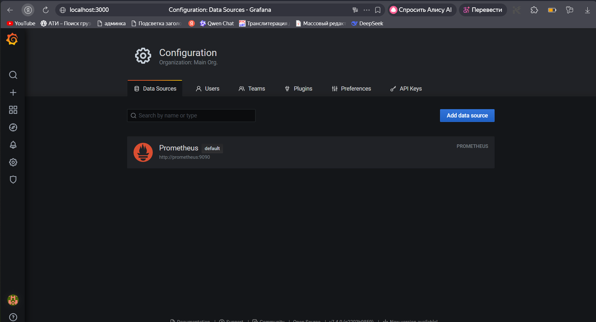
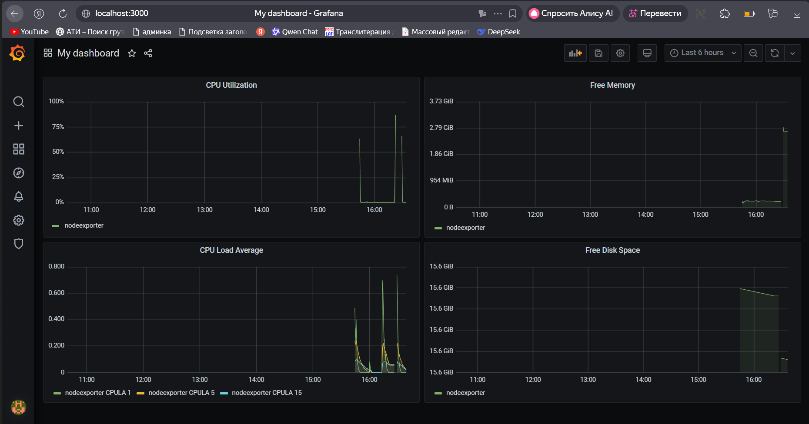
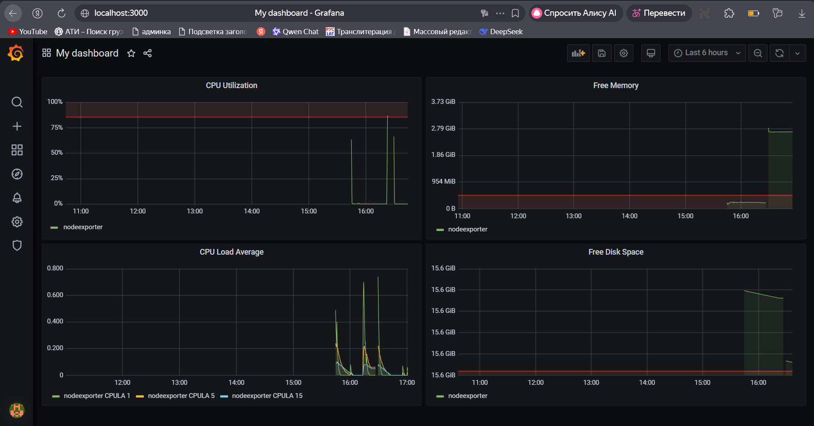

# Домашнее задание к занятию 14 «Средство визуализации Grafana»

## Задание повышенной сложности

**При решении задания 1** не используйте директорию [help](./help) для сборки проекта. Самостоятельно разверните grafana, где в роли источника данных будет выступать prometheus, а сборщиком данных будет node-exporter:

- grafana;
- prometheus-server;
- prometheus node-exporter.

За дополнительными материалами можете обратиться в официальную документацию grafana и prometheus.

В решении к домашнему заданию также приведите все конфигурации, скрипты, манифесты, которые вы 
использовали в процессе решения задания.

**При решении задания 3** вы должны самостоятельно завести удобный для вас канал нотификации, например, Telegram или email, и отправить туда тестовые события.

В решении приведите скриншоты тестовых событий из каналов нотификаций.

## Обязательные задания

### Задание 1

1. Используя директорию [help](./help) внутри этого домашнего задания, запустите связку prometheus-grafana.
2. Зайдите в веб-интерфейс grafana, используя авторизационные данные, указанные в манифесте docker-compose.
3. Подключите поднятый вами prometheus, как источник данных.
4. Решение домашнего задания — скриншот веб-интерфейса grafana со списком подключенных Datasource.

## Задание 2

Изучите самостоятельно ресурсы:

1. [PromQL tutorial for beginners and humans](https://valyala.medium.com/promql-tutorial-for-beginners-9ab455142085).
2. [Understanding Machine CPU usage](https://www.robustperception.io/understanding-machine-cpu-usage).
3. [Introduction to PromQL, the Prometheus query language](https://grafana.com/blog/2020/02/04/introduction-to-promql-the-prometheus-query-language/).

Создайте Dashboard и в ней создайте Panels:

- утилизация CPU для nodeexporter (в процентах, 100-idle);
- CPULA 1/5/15;
- количество свободной оперативной памяти;
- количество места на файловой системе.

Для решения этого задания приведите promql-запросы для выдачи этих метрик, а также скриншот получившейся Dashboard.

## Задание 3

1. Создайте для каждой Dashboard подходящее правило alert — можно обратиться к первой лекции в блоке «Мониторинг».
2. В качестве решения задания приведите скриншот вашей итоговой Dashboard.

## Задание 4

1. Сохраните ваш Dashboard.Для этого перейдите в настройки Dashboard, выберите в боковом меню «JSON MODEL». Далее скопируйте отображаемое json-содержимое в отдельный файл и сохраните его.
2. В качестве решения задания приведите листинг этого файла.

## Ответы к обязательным заданиям

### Задание 1

1. Используя директорию [help](./help) внутри этого домашнего задания, запустите связку prometheus-grafana.
2. Зайдите в веб-интерфейс grafana, используя авторизационные данные, указанные в манифесте docker-compose.
3. Подключите поднятый вами prometheus, как источник данных.
4. Решение домашнего задания — скриншот веб-интерфейса grafana со списком подключенных Datasource.



## Задание 2

Изучите самостоятельно ресурсы:

1. [PromQL tutorial for beginners and humans](https://valyala.medium.com/promql-tutorial-for-beginners-9ab455142085).
2. [Understanding Machine CPU usage](https://www.robustperception.io/understanding-machine-cpu-usage).
3. [Introduction to PromQL, the Prometheus query language](https://grafana.com/blog/2020/02/04/introduction-to-promql-the-prometheus-query-language/).

Создайте Dashboard и в ней создайте Panels:

- утилизация CPU для nodeexporter (в процентах, 100-idle);
- CPULA 1/5/15;
- количество свободной оперативной памяти;
- количество места на файловой системе.

Для решения этого задания приведите promql-запросы для выдачи этих метрик, а также скриншот получившейся Dashboard.

- `100 - (avg by (instance) (rate(node_cpu_seconds_total{mode="idle"}[1m])) * 100)`
- `node_load1{instance="nodeexporter:9100"}`, `node_load5{instance="nodeexporter:9100"}`, `node_load15{instance="nodeexporter:9100"}`
- `node_memory_MemFree_bytes{instance="nodeexporter:9100"}`
- `node_filesystem_avail_bytes{mountpoint="/", instance="nodeexporter:9100"}`



## Задание 3

1. Создайте для каждой Dashboard подходящее правило alert — можно обратиться к первой лекции в блоке «Мониторинг».
1. В качестве решения задания приведите скриншот вашей итоговой Dashboard.



## Задание 4

1. Сохраните ваш Dashboard.Для этого перейдите в настройки Dashboard, выберите в боковом меню «JSON MODEL». Далее скопируйте отображаемое json-содержимое в отдельный файл и сохраните его.
1. В качестве решения задания приведите листинг этого файла.

```declarative
{
  "annotations": {
    "list": [
      {
        "builtIn": 1,
        "datasource": "-- Grafana --",
        "enable": true,
        "hide": true,
        "iconColor": "rgba(0, 211, 255, 1)",
        "name": "Annotations & Alerts",
        "type": "dashboard"
      }
    ]
  },
  "editable": true,
  "gnetId": null,
  "graphTooltip": 0,
  "id": 1,
  "links": [],
  "panels": [
    {
      "alert": {
        "alertRuleTags": {},
        "conditions": [
          {
            "evaluator": {
              "params": [
                85
              ],
              "type": "gt"
            },
            "operator": {
              "type": "and"
            },
            "query": {
              "params": [
                "A",
                "5m",
                "now"
              ]
            },
            "reducer": {
              "params": [],
              "type": "avg"
            },
            "type": "query"
          }
        ],
        "executionErrorState": "alerting",
        "for": "5m",
        "frequency": "1m",
        "handler": 1,
        "name": "CPU Utilization alert",
        "noDataState": "no_data",
        "notifications": []
      },
      "aliasColors": {},
      "bars": false,
      "dashLength": 10,
      "dashes": false,
      "datasource": null,
      "fieldConfig": {
        "defaults": {
          "custom": {},
          "unit": "percent"
        },
        "overrides": []
      },
      "fill": 1,
      "fillGradient": 0,
      "gridPos": {
        "h": 8,
        "w": 12,
        "x": 0,
        "y": 0
      },
      "hiddenSeries": false,
      "id": 2,
      "legend": {
        "alignAsTable": true,
        "avg": false,
        "current": false,
        "max": false,
        "min": false,
        "show": true,
        "total": false,
        "values": false
      },
      "lines": true,
      "linewidth": 1,
      "nullPointMode": "null",
      "options": {
        "alertThreshold": true
      },
      "percentage": false,
      "pluginVersion": "7.4.0",
      "pointradius": 2,
      "points": false,
      "renderer": "flot",
      "seriesOverrides": [],
      "spaceLength": 10,
      "stack": false,
      "steppedLine": false,
      "targets": [
        {
          "expr": "100 - (avg by (instance) (rate(node_cpu_seconds_total{mode=\"idle\"}[1m])) * 100)",
          "interval": "",
          "legendFormat": "nodeexporter",
          "refId": "A"
        }
      ],
      "thresholds": [
        {
          "colorMode": "critical",
          "fill": true,
          "line": true,
          "op": "gt",
          "value": 85,
          "visible": true
        }
      ],
      "timeFrom": null,
      "timeRegions": [],
      "timeShift": null,
      "title": "CPU Utilization",
      "tooltip": {
        "shared": true,
        "sort": 0,
        "value_type": "individual"
      },
      "type": "graph",
      "xaxis": {
        "buckets": null,
        "mode": "time",
        "name": null,
        "show": true,
        "values": []
      },
      "yaxes": [
        {
          "format": "percent",
          "label": null,
          "logBase": 1,
          "max": null,
          "min": null,
          "show": true
        },
        {
          "format": "short",
          "label": null,
          "logBase": 1,
          "max": null,
          "min": null,
          "show": true
        }
      ],
      "yaxis": {
        "align": false,
        "alignLevel": null
      }
    },
    {
      "alert": {
        "alertRuleTags": {},
        "conditions": [
          {
            "evaluator": {
              "params": [
                500000000
              ],
              "type": "lt"
            },
            "operator": {
              "type": "and"
            },
            "query": {
              "params": [
                "A",
                "5m",
                "now"
              ]
            },
            "reducer": {
              "params": [],
              "type": "avg"
            },
            "type": "query"
          }
        ],
        "executionErrorState": "alerting",
        "for": "5m",
        "frequency": "1m",
        "handler": 1,
        "name": "Free Memory alert",
        "noDataState": "no_data",
        "notifications": []
      },
      "aliasColors": {},
      "bars": false,
      "dashLength": 10,
      "dashes": false,
      "datasource": null,
      "fieldConfig": {
        "defaults": {
          "custom": {},
          "unit": "bytes"
        },
        "overrides": []
      },
      "fill": 1,
      "fillGradient": 0,
      "gridPos": {
        "h": 8,
        "w": 12,
        "x": 12,
        "y": 0
      },
      "hiddenSeries": false,
      "id": 6,
      "legend": {
        "avg": false,
        "current": false,
        "max": false,
        "min": false,
        "show": true,
        "total": false,
        "values": false
      },
      "lines": true,
      "linewidth": 1,
      "nullPointMode": "null",
      "options": {
        "alertThreshold": true
      },
      "percentage": false,
      "pluginVersion": "7.4.0",
      "pointradius": 2,
      "points": false,
      "renderer": "flot",
      "seriesOverrides": [],
      "spaceLength": 10,
      "stack": false,
      "steppedLine": false,
      "targets": [
        {
          "expr": "node_memory_MemFree_bytes{instance=\"nodeexporter:9100\"}",
          "interval": "",
          "legendFormat": "nodeexporter",
          "refId": "A"
        }
      ],
      "thresholds": [
        {
          "colorMode": "critical",
          "fill": true,
          "line": true,
          "op": "lt",
          "value": 500000000,
          "visible": true
        }
      ],
      "timeFrom": null,
      "timeRegions": [],
      "timeShift": null,
      "title": "Free Memory",
      "tooltip": {
        "shared": true,
        "sort": 0,
        "value_type": "individual"
      },
      "type": "graph",
      "xaxis": {
        "buckets": null,
        "mode": "time",
        "name": null,
        "show": true,
        "values": []
      },
      "yaxes": [
        {
          "format": "bytes",
          "label": null,
          "logBase": 1,
          "max": null,
          "min": null,
          "show": true
        },
        {
          "format": "short",
          "label": null,
          "logBase": 1,
          "max": null,
          "min": null,
          "show": true
        }
      ],
      "yaxis": {
        "align": false,
        "alignLevel": null
      }
    },
    {
      "alert": {
        "alertRuleTags": {},
        "conditions": [
          {
            "evaluator": {
              "params": [
                4
              ],
              "type": "gt"
            },
            "operator": {
              "type": "and"
            },
            "query": {
              "params": [
                "B",
                "5m",
                "now"
              ]
            },
            "reducer": {
              "params": [],
              "type": "avg"
            },
            "type": "query"
          }
        ],
        "executionErrorState": "alerting",
        "for": "10m",
        "frequency": "1m",
        "handler": 1,
        "name": "CPU Load Average alert",
        "noDataState": "no_data",
        "notifications": []
      },
      "aliasColors": {},
      "bars": false,
      "dashLength": 10,
      "dashes": false,
      "datasource": null,
      "fieldConfig": {
        "defaults": {
          "custom": {},
          "unit": "short"
        },
        "overrides": []
      },
      "fill": 1,
      "fillGradient": 0,
      "gridPos": {
        "h": 8,
        "w": 12,
        "x": 0,
        "y": 8
      },
      "hiddenSeries": false,
      "id": 4,
      "legend": {
        "alignAsTable": false,
        "avg": false,
        "current": false,
        "max": false,
        "min": false,
        "show": true,
        "total": false,
        "values": false
      },
      "lines": true,
      "linewidth": 1,
      "nullPointMode": "null",
      "options": {
        "alertThreshold": true
      },
      "percentage": false,
      "pluginVersion": "7.4.0",
      "pointradius": 2,
      "points": false,
      "renderer": "flot",
      "seriesOverrides": [],
      "spaceLength": 10,
      "stack": false,
      "steppedLine": false,
      "targets": [
        {
          "expr": "node_load1{instance=\"nodeexporter:9100\"}",
          "interval": "",
          "legendFormat": "nodeexporter CPULA 1",
          "refId": "A"
        },
        {
          "expr": "node_load5{instance=\"nodeexporter:9100\"}",
          "hide": false,
          "interval": "",
          "legendFormat": "nodeexporter CPULA 5",
          "refId": "B"
        },
        {
          "expr": "node_load15{instance=\"nodeexporter:9100\"}",
          "hide": false,
          "interval": "",
          "legendFormat": "nodeexporter CPULA 15",
          "refId": "C"
        }
      ],
      "thresholds": [
        {
          "colorMode": "critical",
          "fill": true,
          "line": true,
          "op": "gt",
          "value": 4,
          "visible": true
        }
      ],
      "timeFrom": null,
      "timeRegions": [],
      "timeShift": null,
      "title": "CPU Load Average",
      "tooltip": {
        "shared": true,
        "sort": 0,
        "value_type": "individual"
      },
      "type": "graph",
      "xaxis": {
        "buckets": null,
        "mode": "time",
        "name": null,
        "show": true,
        "values": []
      },
      "yaxes": [
        {
          "format": "short",
          "label": null,
          "logBase": 1,
          "max": null,
          "min": null,
          "show": true
        },
        {
          "format": "short",
          "label": null,
          "logBase": 1,
          "max": null,
          "min": null,
          "show": true
        }
      ],
      "yaxis": {
        "align": false,
        "alignLevel": null
      }
    },
    {
      "alert": {
        "alertRuleTags": {},
        "conditions": [
          {
            "evaluator": {
              "params": [
                16735831601
              ],
              "type": "lt"
            },
            "operator": {
              "type": "and"
            },
            "query": {
              "params": [
                "A",
                "5m",
                "now"
              ]
            },
            "reducer": {
              "params": [],
              "type": "avg"
            },
            "type": "query"
          }
        ],
        "executionErrorState": "alerting",
        "for": "5m",
        "frequency": "1m",
        "handler": 1,
        "name": "Free Disk Space alert",
        "noDataState": "no_data",
        "notifications": []
      },
      "aliasColors": {},
      "bars": false,
      "dashLength": 10,
      "dashes": false,
      "datasource": null,
      "fieldConfig": {
        "defaults": {
          "custom": {},
          "unit": "bytes"
        },
        "overrides": []
      },
      "fill": 1,
      "fillGradient": 0,
      "gridPos": {
        "h": 8,
        "w": 12,
        "x": 12,
        "y": 8
      },
      "hiddenSeries": false,
      "id": 8,
      "legend": {
        "avg": false,
        "current": false,
        "max": false,
        "min": false,
        "show": true,
        "total": false,
        "values": false
      },
      "lines": true,
      "linewidth": 1,
      "nullPointMode": "null",
      "options": {
        "alertThreshold": true
      },
      "percentage": false,
      "pluginVersion": "7.4.0",
      "pointradius": 2,
      "points": false,
      "renderer": "flot",
      "seriesOverrides": [],
      "spaceLength": 10,
      "stack": false,
      "steppedLine": false,
      "targets": [
        {
          "expr": "node_filesystem_avail_bytes{mountpoint=\"/\", instance=\"nodeexporter:9100\"}",
          "interval": "",
          "legendFormat": "nodeexporter",
          "refId": "A"
        }
      ],
      "thresholds": [
        {
          "colorMode": "critical",
          "fill": true,
          "line": true,
          "op": "lt",
          "value": 16735831601,
          "visible": true
        }
      ],
      "timeFrom": null,
      "timeRegions": [],
      "timeShift": null,
      "title": "Free Disk Space",
      "tooltip": {
        "shared": true,
        "sort": 0,
        "value_type": "individual"
      },
      "type": "graph",
      "xaxis": {
        "buckets": null,
        "mode": "time",
        "name": null,
        "show": true,
        "values": []
      },
      "yaxes": [
        {
          "format": "bytes",
          "label": null,
          "logBase": 1,
          "max": null,
          "min": null,
          "show": true
        },
        {
          "format": "short",
          "label": null,
          "logBase": 1,
          "max": null,
          "min": null,
          "show": true
        }
      ],
      "yaxis": {
        "align": false,
        "alignLevel": null
      }
    }
  ],
  "refresh": false,
  "schemaVersion": 27,
  "style": "dark",
  "tags": [],
  "templating": {
    "list": []
  },
  "time": {
    "from": "now-6h",
    "to": "now"
  },
  "timepicker": {},
  "timezone": "",
  "title": "My dashboard",
  "uid": "QcHsrKKvz",
  "version": 2
}
```

---

### Как оформить решение задания

Выполненное домашнее задание пришлите в виде ссылки на .md-файл в вашем репозитории.

---
