# Домашнее задание к занятию «Основы Terraform. Yandex Cloud»

### Цели задания

1. Создать свои ресурсы в облаке Yandex Cloud с помощью Terraform.
2. Освоить работу с переменными Terraform.


### Чек-лист готовности к домашнему заданию

1. Зарегистрирован аккаунт в Yandex Cloud. Использован промокод на грант.
2. Установлен инструмент Yandex CLI.
3. Исходный код для выполнения задания расположен в директории [**02/src**](https://github.com/netology-code/ter-homeworks/tree/main/02/src).

### Выполнение чек-листа готовности к домашнему заданию

1. Зарегистрирован аккаунт в Yandex Cloud. Использован промокод на грант.
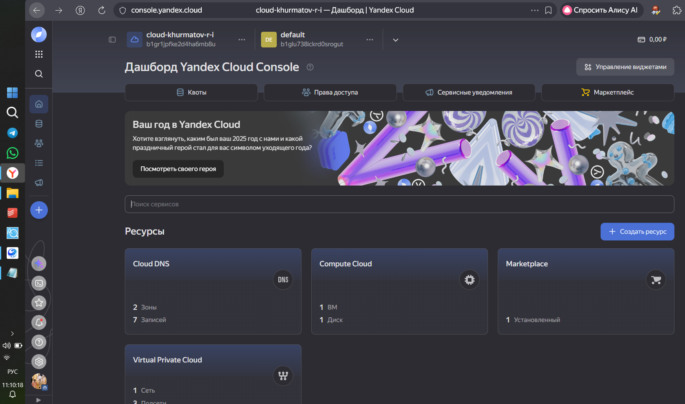

2. Установлен инструмент Yandex CLI.
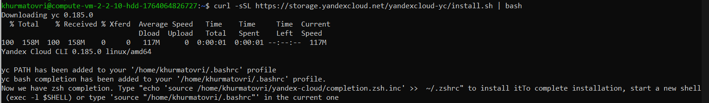

3. Исходный код для выполнения задания расположен в директории [**02/src**](https://github.com/netology-code/ter-homeworks/tree/main/02/src).
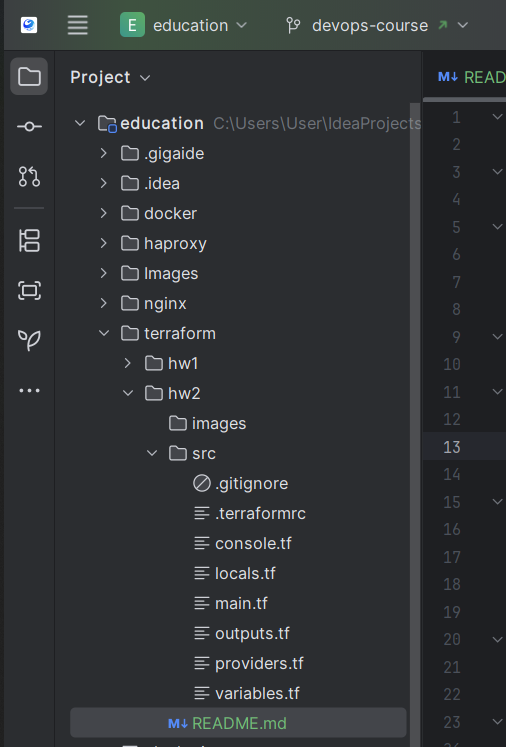

### Задание 0

1. Ознакомьтесь с [документацией к security-groups в Yandex Cloud](https://cloud.yandex.ru/docs/vpc/concepts/security-groups?from=int-console-help-center-or-nav).
   Этот функционал понадобится к следующей лекции.

### Решение 0

1. Ознакомился с документацией [документацией к security-groups в Yandex Cloud](https://cloud.yandex.ru/docs/vpc/concepts/security-groups?from=int-console-help-center-or-nav).

------
### Внимание!! Обязательно предоставляем на проверку получившийся код в виде ссылки на ваш github-репозиторий!
------

### Задание 1
В качестве ответа всегда полностью прикладывайте ваш terraform-код в git.
Убедитесь что ваша версия **Terraform** ~>1.12.0

1. Изучите проект. В файле variables.tf объявлены переменные для Yandex provider.
2. Создайте сервисный аккаунт и ключ. [service_account_key_file](https://terraform-provider.yandexcloud.net).
3. Сгенерируйте новый или используйте свой текущий ssh-ключ. Запишите его открытую(public) часть в переменную **vms_ssh_public_root_key**.
4. Инициализируйте проект, выполните код. Исправьте намеренно допущенные синтаксические ошибки. Ищите внимательно, посимвольно. Ответьте, в чём заключается их суть.
5. Подключитесь к консоли ВМ через ssh и выполните команду ``` curl ifconfig.me```.
   Примечание: К OS ubuntu "out of a box, те из коробки" необходимо подключаться под пользователем ubuntu: ```"ssh ubuntu@vm_ip_address"```. Предварительно убедитесь, что ваш ключ добавлен в ssh-агент: ```eval $(ssh-agent) && ssh-add``` Вы познакомитесь с тем как при создании ВМ создать своего пользователя в блоке metadata в следующей лекции.;
6. Ответьте, как в процессе обучения могут пригодиться параметры ```preemptible = true``` и ```core_fraction=5``` в параметрах ВМ.

В качестве решения приложите:

- скриншот ЛК Yandex Cloud с созданной ВМ, где видно внешний ip-адрес;
- скриншот консоли, curl должен отобразить тот же внешний ip-адрес;
- ответы на вопросы.

### Решение 1
В качестве ответа всегда полностью прикладывайте ваш terraform-код в git.
Убедитесь что ваша версия **Terraform** ~>1.12.0
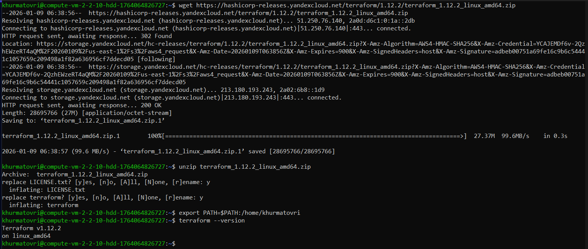

1. Изучил проект. Добавил недостающие строки default в файл variables.tf:
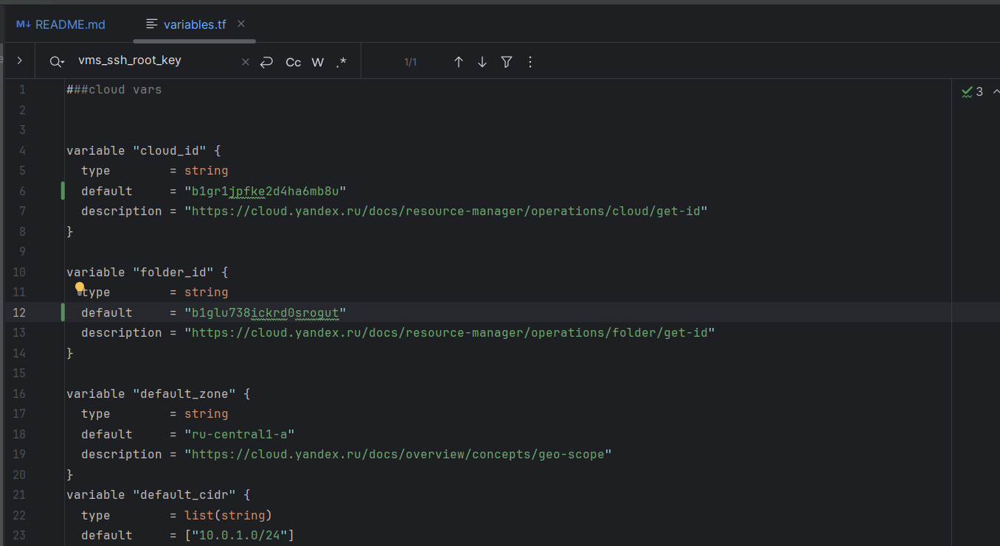

2. Создал сервис аккаунт и ключ:
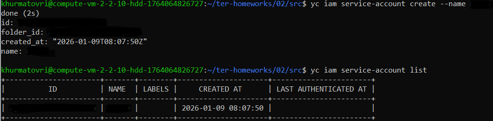
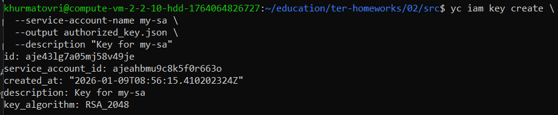

3. Записал открытую(public) часть своего ssh-ключа в переменную ```vms_ssh_root_key```
```
variable "vms_ssh_root_key" {
  type        = string
  default     = "ssh-ed25519 AAAAC3NzaC1lZDI1NTE5AAAAIAZ8JS3GqbSgTYGq8CzTYhfYG5nhcrn83RV7pXccbBTz"
  description = "ssh-keygen -t ed25519"
}
```

4. Инициализировал проект, выполнение кода не выполнилось из-за ошибок:
4.1. В файле **main.tf** допущена опечатка в слове ```standart``` и указана неверная версия, (допустимы v1, v2, v3):
```
Error: Error while requesting API to create instance: client-request-id = 3f962eb2-1bf2-40ed-a01c-f486edb767c2 client-trace-id = 68c86a34-90b1-4e25-a567-ff5ff7af1c68 rpc error: code = FailedPrecondition desc = Platform "standart-v4" not found
│
│   with yandex_compute_instance.platform,
│   on main.tf line 15, in resource "yandex_compute_instance" "platform":
│   15: resource "yandex_compute_instance" "platform" {
```
Исправил ```standart-v4``` на ```standard-v3```

4.2. В файле **main.tf** указаны неверно resources:
```  
  resources {
    cores         = 1
    memory        = 1
    core_fraction = 5
```
```
Error: Error while requesting API to create instance: client-request-id = 6deb0045-dd1d-451a-95a3-76c7ce2c6d6f client-trace-id = ee6e93ab-6deb-48d9-8b61-a5de9806c79a rpc error: code = InvalidArgument desc = the specified core fraction is not available on platform "standard-v3"; allowed core fractions: 20, 50, 100
│
│   with yandex_compute_instance.platform,
│   on main.tf line 15, in resource "yandex_compute_instance" "platform":
│   15: resource "yandex_compute_instance" "platform" {
```
```
Error: Error while requesting API to create instance: client-request-id = b760df97-cef4-4e3f-8e1e-1d13424f7d9c client-trace-id = a592ef98-458f-44ec-bc21-7a9766172907 rpc error: code = InvalidArgument desc = the specified number of cores is not available on platform "standard-v3"; allowed core number: 2, 4
│
│   with yandex_compute_instance.platform,
│   on main.tf line 15, in resource "yandex_compute_instance" "platform":
│   15: resource "yandex_compute_instance" "platform" {
```
Исправил количество, так как разрешено cores минимум 2, а core_fraction минимум 20:
```  
  resources {
    cores         = 2
    memory        = 1
    core_fraction = 20
```

После исправления ошибок, код выполнился:
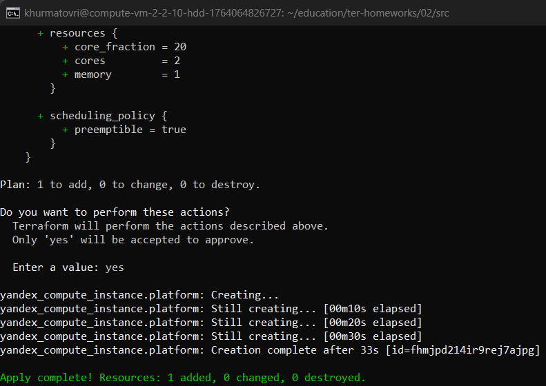

Создалась ВМ:
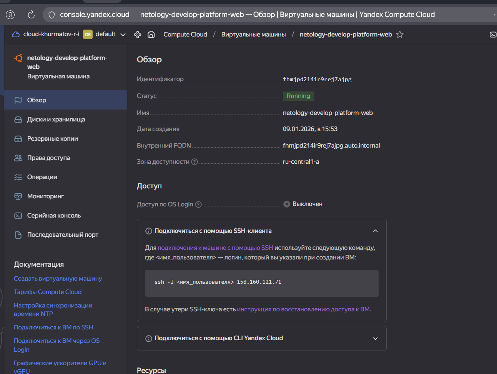

5. Подключился к ВМ по ssh и получил вывод команды ```curl ifconfig.me```:
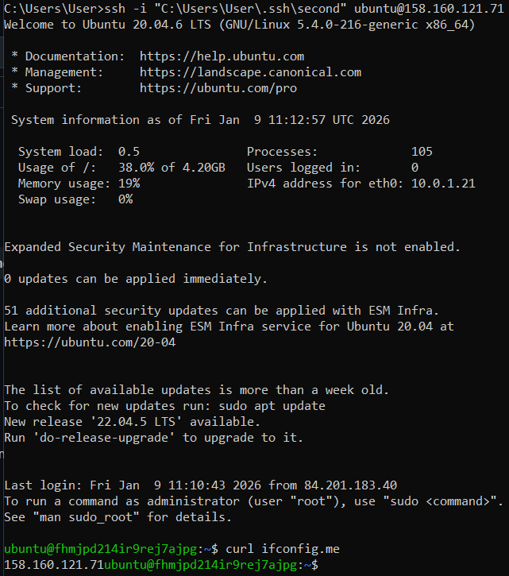

6. Параметр ```preemptible = true``` отвечает за прерываемость ВМ после 24 часов работы, что помогает съэкономить ресурсы.
Параметр ```core_fraction=5``` позволяет задать максимальную загрузку виртуальных ядер, что тоже может позволить съэконоить денежные средства во время обучения.

### Задание 2

1. Замените все хардкод-**значения** для ресурсов **yandex_compute_image** и **yandex_compute_instance** на **отдельные** переменные. К названиям переменных ВМ добавьте в начало префикс **vm_web_** .  Пример: **vm_web_name**.
2. Объявите нужные переменные в файле variables.tf, обязательно указывайте тип переменной. Заполните их **default** прежними значениями из main.tf.
3. Проверьте terraform plan. Изменений быть не должно.

### Решение 2

1. Заменил хардкод-**значения** для ресурсов **yandex_compute_image** и **yandex_compute_instance** на **отдельные** переменные.
```main.tf```
```
resource "yandex_vpc_network" "develop" {
  name = var.vpc_name
}
resource "yandex_vpc_subnet" "develop" {
  name           = var.vpc_name
  zone           = var.default_zone
  network_id     = yandex_vpc_network.develop.id
  v4_cidr_blocks = var.default_cidr
}


data "yandex_compute_image" "ubuntu" {
  family = var.vm_web_image_name
}
resource "yandex_compute_instance" "platform" {
  name            = var.vm_web_name
  platform_id     = var.vm_web_platform_id
  resources {
    cores         = var.vm_web_resources.cores
    memory        = var.vm_web_resources.memory
    core_fraction = var.vm_web_resources.core_fraction
  }
  boot_disk {
    initialize_params {
      image_id = data.yandex_compute_image.ubuntu.image_id
    }
  }
  scheduling_policy {
    preemptible = true
  }
  network_interface {
    subnet_id = yandex_vpc_subnet.develop.id
    nat       = true
  }

  metadata = {
    serial-port-enable = 1
    ssh-keys           = "ubuntu:${var.vms_ssh_root_key}"
  }

}
```

2. Объявил нужные переменные в файле variables.tf.
   ```variables.tf```
```
###cloud vars

variable "cloud_id" {
  type        = string
  default     = "b1gr1jpfke2d4ha6mb8u"
  description = "https://cloud.yandex.ru/docs/resource-manager/operations/cloud/get-id"
}

variable "folder_id" {
  type        = string
  default     = "b1glu738ickrd0srogut"
  description = "https://cloud.yandex.ru/docs/resource-manager/operations/folder/get-id"
}

variable "default_zone" {
  type        = string
  default     = "ru-central1-a"
  description = "https://cloud.yandex.ru/docs/overview/concepts/geo-scope"
}
variable "default_cidr" {
  type        = list(string)
  default     = ["10.0.1.0/24"]
  description = "https://cloud.yandex.ru/docs/vpc/operations/subnet-create"
}

variable "vpc_name" {
  type        = string
  default     = "develop"
  description = "VPC network & subnet name"
}

###ssh vars

variable "vms_ssh_root_key" {
  type        = string
  default     = "ssh-ed25519 AAAAC3NzaC1lZDI1NTE5AAAAIAZ8JS3GqbSgTYGq8CzTYhfYG5nhcrn83RV7pXccbBTz"
  description = "ssh-keygen -t ed25519"
}

### yandex_compute_image vars

variable "vm_web_image_name" {
  type        = string
  default     = "ubuntu-2004-lts"
  description = "Имя образа ОС"
}

### yandex_compute_instance vars

variable "vm_web_name" {
  type        = string
  default     = "netology-develop-platform-web"
  description = "Имя виртуальной машины"
}
variable "vm_web_platform_id" {
  type = string
  default = "standard-v3"
  description = "ID виртуальной платформы"
}
variable "vm_web_resources" {
  type = map(number)
  default = {
    cores          = 2
    memory         = 1
    core_fraction  = 20
 }
}
```

3. Выполнил команду ```terraform plan```:
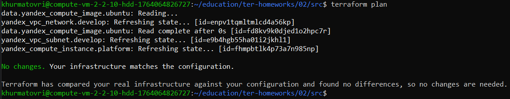

### Задание 3

1. Создайте в корне проекта файл 'vms_platform.tf' . Перенесите в него все переменные первой ВМ.
2. Скопируйте блок ресурса и создайте с его помощью вторую ВМ в файле main.tf: **"netology-develop-platform-db"** ,  ```cores  = 2, memory = 2, core_fraction = 20```. Объявите её переменные с префиксом **vm_db_** в том же файле ('vms_platform.tf').  ВМ должна работать в зоне "ru-central1-b"
3. Примените изменения.

### Решение 3

1. Создал в корне проекта файл 'vms_platform.tf'. Перенес в него все переменные первой ВМ.
```vms_platform.tf```:
```
### yandex_compute_image vars

variable "vm_db_zone" {
  type = string
  default = "ru-central1-b"
  description = "Рабочая зона"
}

variable "vm_db_image_name" {
  type        = string
  default     = "ubuntu-2004-lts"
  description = "Имя образа ОС"
}

### yandex_compute_instance vars

variable "vm_db_name" {
  type        = string
  default     = "netology-develop-platform-db"
  description = "Имя виртуальной машины"
}
variable "vm_db_platform_id" {
  type = string
  default = "standard-v3"
  description = "ID виртуальной платформы"
}
variable "vm_db_resources" {
  type = map(number)
  default = {
    cores          = 2
    memory         = 2
    core_fraction  = 20
 }
}
```

2. Для корректной работы второй ВМ в другой сетевой зоне необходимо было добавить в **main.tf** блок кода с описанием второй сети:
```
## новая подсеть для работы в другой зоне
resource "yandex_vpc_subnet" "develop2" {
  name            = var.vpc_name2
  zone            = var.default_zone2
  network_id      = yandex_vpc_network.develop.id
  v4_cidr_blocks  = var.default_cidr2
}
```
3. Применил изменения, создалась вторая ВМ:
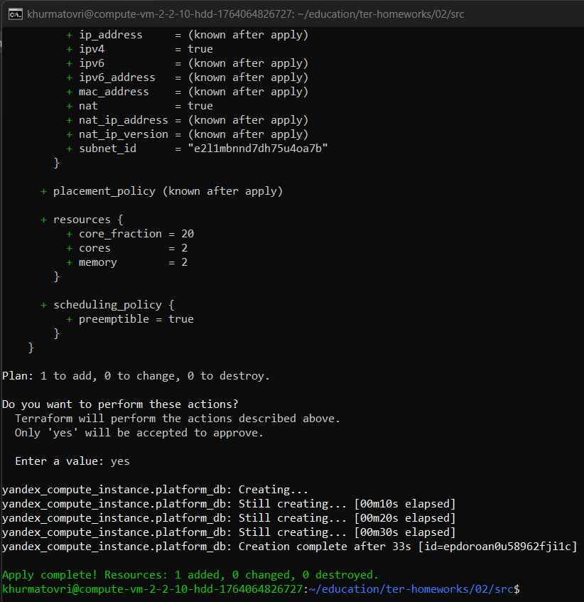
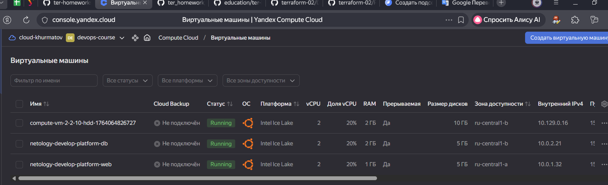

### Задание 4

1. Объявите в файле outputs.tf **один** output , содержащий: instance_name, external_ip, fqdn для каждой из ВМ в удобном лично для вас формате.(без хардкода!!!)
2. Примените изменения.

В качестве решения приложите вывод значений ip-адресов команды ```terraform output```.

### Решение 4

1. ```outputs.tf```:
```
output "VMs_output" {
  value = {
    VM_web_name   = yandex_compute_instance.platform_web.name
    VM_web_FQDN   = yandex_compute_instance.platform_web.fqdn
    VM_web_ext_ip = yandex_compute_instance.platform_web.network_interface[0].nat_ip_address
    VM_db_name    = yandex_compute_instance.platform_db.name
    VM_db_FQDN   = yandex_compute_instance.platform_db.fqdn
    VM_db_ext_ip = yandex_compute_instance.platform_db.network_interface[0].nat_ip_address
  }
}
```
2. Применил изменения, ниже вывод команды ```terraform output```:
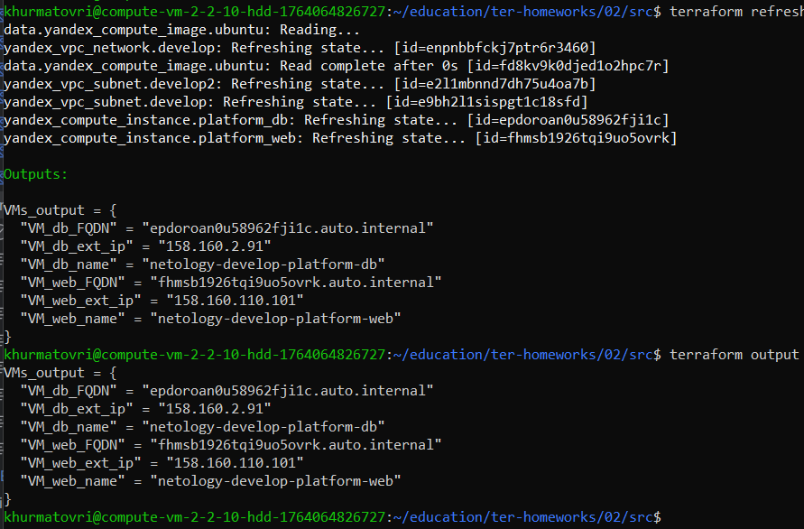

### Задание 5

1. В файле locals.tf опишите в **одном** local-блоке имя каждой ВМ, используйте интерполяцию ${..} с НЕСКОЛЬКИМИ переменными по примеру из лекции.
2. Замените переменные внутри ресурса ВМ на созданные вами local-переменные.
3. Примените изменения.

### Решение 5

1. Добавил в ```local.tf```:
```
locals {
  lplatform    = "netology-develop-platform"
  lweb         = "web"
  ldb          = "db"
  vm_web_lname = "${ local.lplatform }-${ local.lweb }"
  vm_db_lname  = "${ local.lplatform }-${ local.ldb }"
}
```
2. Внес изменения в ```main.tf```:
```
resource "yandex_compute_instance" "platform_web" {
  # name          = var.vm_web_name
  name            = local.vm_web_lname
  
resource "yandex_compute_instance" "platform_db" {
  # name            = var.vm_db_name
  name            = local.vm_db_lname
```
3. Применил измнения, но новое наименование оставило конфигурацию без изменений:


### Задание 6

1. Вместо использования трёх переменных  ".._cores",".._memory",".._core_fraction" в блоке  resources {...}, объедините их в единую map-переменную **vms_resources** и  внутри неё конфиги обеих ВМ в виде вложенного map(object).
   ```
   пример из terraform.tfvars:
   vms_resources = {
     web={
       cores=2
       memory=2
       core_fraction=5
       hdd_size=10
       hdd_type="network-hdd"
       ...
     },
     db= {
       cores=2
       memory=4
       core_fraction=20
       hdd_size=10
       hdd_type="network-ssd"
       ...
     }
   }
   ```
2. Создайте и используйте отдельную map(object) переменную для блока metadata, она должна быть общая для всех ваших ВМ.
   ```
   пример из terraform.tfvars:
   metadata = {
     serial-port-enable = 1
     ssh-keys           = "ubuntu:ssh-ed25519 AAAAC..."
   }
   ```  

3. Найдите и закоментируйте все, более не используемые переменные проекта.
4. Проверьте terraform plan. Изменений быть не должно.

### Решение 6

1. Добавил общую переменную для ресурсов в ```variables.tf```:
```
variable "vms_resources" {
  type = map(map(number))
  description = "Общие ресурсы для виртуальных машин"
  default = {
    vm_web_resources = {
      cores = 2
      memory = 1
      core_fraction = 20
    }
    vm_db_resources = {
      cores = 2
      memory = 2
      core_fraction = 20
    }
  }
}
```

2. Добавил общую переменную для метадата и добавил в ```variables.tf```:
```
variable "common_metadata" {
     description = "Общая переменная для метадаты"
            type = map(string)
         default = {
           serial-port-enable = "1"
           ssh-keys           = "ubuntu:ssh-ed25519 AAAAC3NzaC1lZDI1NTE5AAAAIAZ8JS3GqbSgTYGq8CzTYhfYG5nhcrn83RV7pXccbBTz"
         }
}
```

3. Лишнее закомментил, либо удалил.
4. После изменений ```terraform plan``` работает без ошибок:
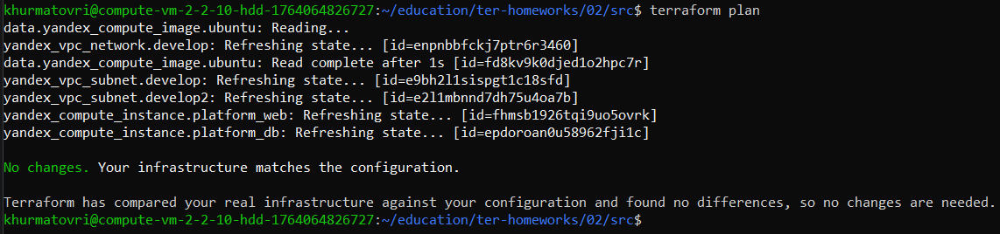

------

## Дополнительное задание (со звёздочкой*)

**Настоятельно рекомендуем выполнять все задания со звёздочкой.**   
Они помогут глубже разобраться в материале. Задания со звёздочкой дополнительные, не обязательные к выполнению и никак не повлияют на получение вами зачёта по этому домашнему заданию.


------
### Задание 7*

Изучите содержимое файла console.tf. Откройте terraform console, выполните следующие задания:

1. Напишите, какой командой можно отобразить **второй** элемент списка test_list.
2. Найдите длину списка test_list с помощью функции length(<имя переменной>).
3. Напишите, какой командой можно отобразить значение ключа admin из map test_map.
4. Напишите interpolation-выражение, результатом которого будет: "John is admin for production server based on OS ubuntu-20-04 with X vcpu, Y ram and Z virtual disks", используйте данные из переменных test_list, test_map, servers и функцию length() для подстановки значений.

**Примечание**: если не догадаетесь как вычленить слово "admin", погуглите: "terraform get keys of map"

В качестве решения предоставьте необходимые команды и их вывод.

------

### Задание 8*
1. Напишите и проверьте переменную test и полное описание ее type в соответствии со значением из terraform.tfvars:
```
test = [
  {
    "dev1" = [
      "ssh -o 'StrictHostKeyChecking=no' ubuntu@62.84.124.117",
      "10.0.1.7",
    ]
  },
  {
    "dev2" = [
      "ssh -o 'StrictHostKeyChecking=no' ubuntu@84.252.140.88",
      "10.0.2.29",
    ]
  },
  {
    "prod1" = [
      "ssh -o 'StrictHostKeyChecking=no' ubuntu@51.250.2.101",
      "10.0.1.30",
    ]
  },
]
```
2. Напишите выражение в terraform console, которое позволит вычленить строку "ssh -o 'StrictHostKeyChecking=no' ubuntu@62.84.124.117" из этой переменной.
------

------

### Задание 9*

Используя инструкцию https://cloud.yandex.ru/ru/docs/vpc/operations/create-nat-gateway#tf_1, настройте для ваших ВМ nat_gateway. Для проверки уберите внешний IP адрес (nat=false) у ваших ВМ и проверьте доступ в интернет с ВМ, подключившись к ней через serial console. Для подключения предварительно через ssh измените пароль пользователя: ```sudo passwd ubuntu```

### Правила приёма работыДля подключения предварительно через ssh измените пароль пользователя: sudo passwd ubuntu
В качестве результата прикрепите ссылку на MD файл с описанием выполненой работы в вашем репозитории. Так же в репозитории должен присутсвовать ваш финальный код проекта.

**Важно. Удалите все созданные ресурсы**.


### Критерии оценки

Зачёт ставится, если:

* выполнены все задания,
* ответы даны в развёрнутой форме,
* приложены соответствующие скриншоты и файлы проекта,
* в выполненных заданиях нет противоречий и нарушения логики.

На доработку работу отправят, если:

* задание выполнено частично или не выполнено вообще,
* в логике выполнения заданий есть противоречия и существенные недостатки. 

