# Домашнее задание к занятию «Введение в Terraform»

### Цели задания

1. Установить и настроить Terrafrom.
2. Научиться использовать готовый код.

------

### Чек-лист готовности к домашнему заданию

1. Скачайте и установите **Terraform** версии >=1.12.0 . Приложите скриншот вывода команды ```terraform --version```.
2. Скачайте на свой ПК этот git-репозиторий. Исходный код для выполнения задания расположен в директории **01/src**.
3. Убедитесь, что в вашей ОС установлен docker.

### Выполнение чек-листа готовности к домашнему заданию
1. Скачиваем дистрибутив Terraform 1.9.8, используя зеркало Яндекс при помощи утилиты wget, разархивируем скачанный архив, после этого необходимо добавить путь к директории, в которой находится исполняемый файл terraform, используя переменную PATH и команду: ```export PATH=$PATH:/home/khurmatovri```
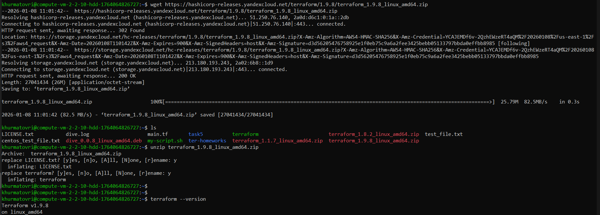

2. Скачиваем git-репозиторий
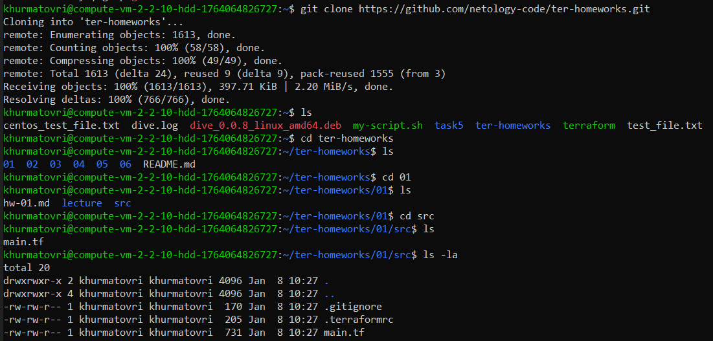

3. Проверяем версию Docker на ВМ  
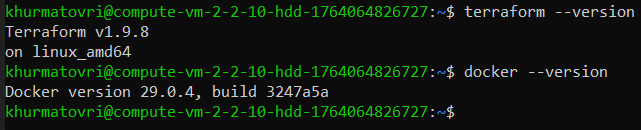

------

### Инструменты и дополнительные материалы, которые пригодятся для выполнения задания

1. Репозиторий с ссылкой на зеркало для установки и настройки Terraform: [ссылка](https://github.com/netology-code/devops-materials).
2. Установка docker: [ссылка](https://docs.docker.com/engine/install/ubuntu/).
------
### Внимание!! Обязательно предоставляем на проверку получившийся код в виде ссылки на ваш github-репозиторий!
------

### Задание 1

1. Перейдите в каталог [**src**](https://github.com/netology-code/ter-homeworks/tree/main/01/src). Скачайте все необходимые зависимости, использованные в проекте.
2. Изучите файл **.gitignore**. В каком terraform-файле, согласно этому .gitignore, допустимо сохранить личную, секретную информацию?(логины,пароли,ключи,токены итд)
3. Выполните код проекта. Найдите  в state-файле секретное содержимое созданного ресурса **random_password**, пришлите в качестве ответа конкретный ключ и его значение.
4. Раскомментируйте блок кода, примерно расположенный на строчках 29–42 файла **main.tf**.
   Выполните команду ```terraform validate```. Объясните, в чём заключаются намеренно допущенные ошибки. Исправьте их.
5. Выполните код. В качестве ответа приложите: исправленный фрагмент кода и вывод команды ```docker ps```.
6. Замените имя docker-контейнера в блоке кода на ```hello_world```. Не перепутайте имя контейнера и имя образа. Мы всё ещё продолжаем использовать name = "nginx:latest". Выполните команду ```terraform apply -auto-approve```.
   Объясните своими словами, в чём может быть опасность применения ключа  ```-auto-approve```. Догадайтесь или нагуглите зачем может пригодиться данный ключ? В качестве ответа дополнительно приложите вывод команды ```docker ps```.
8. Уничтожьте созданные ресурсы с помощью **terraform**. Убедитесь, что все ресурсы удалены. Приложите содержимое файла **terraform.tfstate**.
9. Объясните, почему при этом не был удалён docker-образ **nginx:latest**. Ответ **ОБЯЗАТЕЛЬНО НАЙДИТЕ В ПРЕДОСТАВЛЕННОМ КОДЕ**, а затем **ОБЯЗАТЕЛЬНО ПОДКРЕПИТЕ** строчкой из документации [**terraform провайдера docker**](https://library.tf/providers/kreuzwerker/docker/latest).  (ищите в классификаторе resource docker_image )

### Решение 1
1. Скачиваем зависимости, использованные в проекте командой ```terraform init```
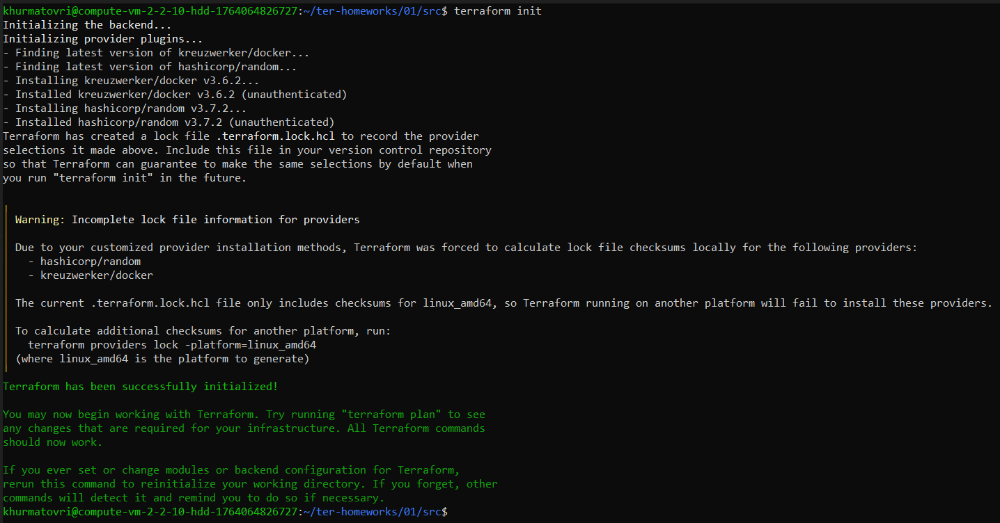

2. Файл **.gitignore**:
```
# Local .terraform directories and files
**/.terraform/*
.terraform*

!.terraformrc

# .tfstate files
*.tfstate
*.tfstate.*

# own secret vars store.
personal.auto.tfvars
```

Хранить личную, секретную информацию(логины, пароли, ключи, токены и т.д.) исходя из лекций допустимо в файле ```personal.auto.tfvars```

3. Выполним код проекта командой ```terraform apply```:
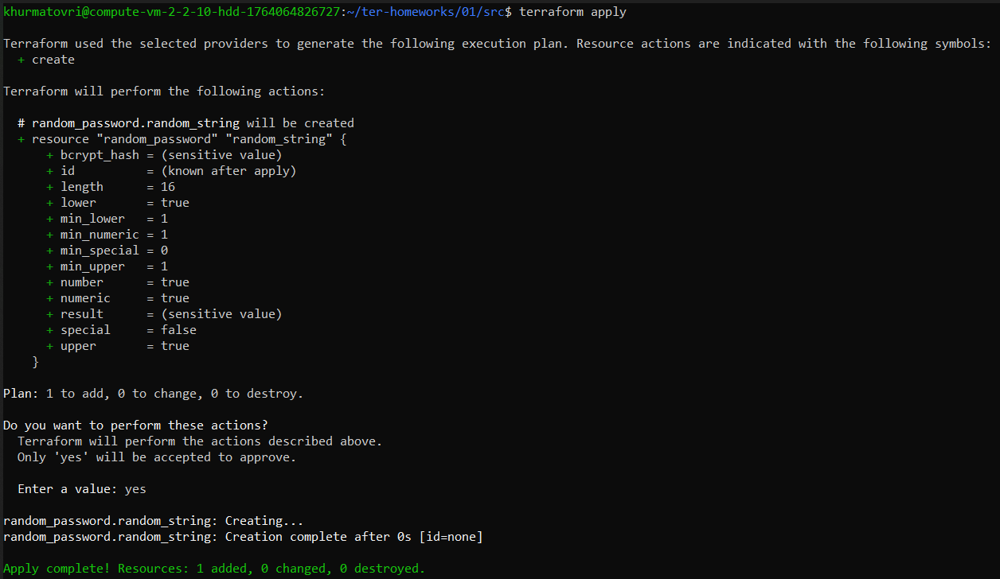

В state-файле найдем секретное содержимое созданного ресурса **random_password**:
```
{
  "version": 4,
  "terraform_version": "1.9.8",
  "serial": 1,
  "lineage": "6b370293-91ab-4ceb-fd96-459c59b15797",
  "outputs": {},
  "resources": [
    {
      "mode": "managed",
      "type": "random_password",
      "name": "random_string",
      "provider": "provider[\"registry.terraform.io/hashicorp/random\"]",
      "instances": [
        {
          "schema_version": 3,
          "attributes": {
            "bcrypt_hash": "$2a$10$hpJC9qtGj3RFtJpO6dXD6ONjlRbeMqoxH9UViyKviOT1Y5ZEjtuH6",
            "id": "none",
            "keepers": null,
            "length": 16,
            "lower": true,
            "min_lower": 1,
            "min_numeric": 1,
            "min_special": 0,
            "min_upper": 1,
            "number": true,
            "numeric": true,
            "override_special": null,
            "result": "2Acu7go0MZjbLvA7",
            "special": false,
            "upper": true
          },
          "sensitive_attributes": [
            [
              {
                "type": "get_attr",
                "value": "result"
              }
            ],
            [
              {
                "type": "get_attr",
                "value": "bcrypt_hash"
              }
            ]
          ]
        }
      ]
    }
  ],
  "check_results": null
}
```

Значение:
```"result": "2Acu7go0MZjbLvA7"```

4. Раскомментируем блок кода:
```
/*
resource "docker_image" {
  name         = "nginx:latest"
  keep_locally = true
}

resource "docker_container" "1nginx" {
  image = docker_image.nginx.image_id
  name  = "example_${random_password.random_string_FAKE.resulT}"

  ports {
    internal = 80
    external = 9090
  }
}
*/
```

При выполнении команды ```terraform validate``` получаем ошибки:
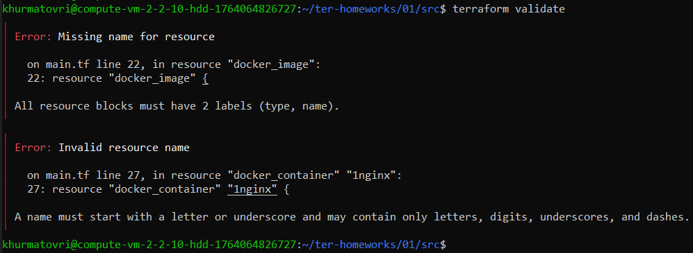

Получаем 3 ошибки:  
1 ошибка - в блоке ```resource "docker_image"```, согласно документации блок ```resource``` указывается в следующем формате: ```resource "<TYPE>" "<LABEL>"   block```, "TYPE" задан, но не задан "LABEL", исправим на ```resource "docker_image" "nginx"```  
2 ошибка - в блоке ```resource "docker_container" "1nginx"```, согласно документации имя не должно начинать с цифры, исправим на ```resource "docker_container" "nginx"```  
3 ошибка - допущена опечатка в блоке ```name  = "example_${random_password.random_string_FAKE.resulT}"```, исправим на ```name  = "example_${random_password.random_string.result}"```  

После исправлений команда ```terraform validate``` работает как надо:
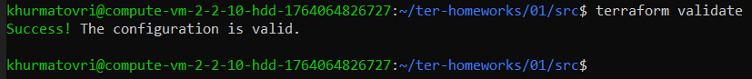

5. После исправлений код выглядит следующим образом:
```
resource "docker_image" "nginx" {
  name         = "nginx:latest"
  keep_locally = true
}

resource "docker_container" "nginx" {
  image = docker_image.nginx.image_id
  name  = "example_${random_password.random_string.result}"

  ports {
    internal = 80
    external = 9090
  }
}
```

Выполним исправленный код:
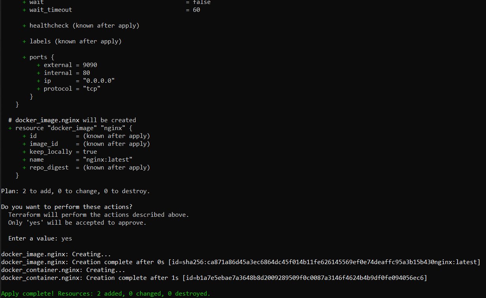
Вывод команды ```docker ps```:
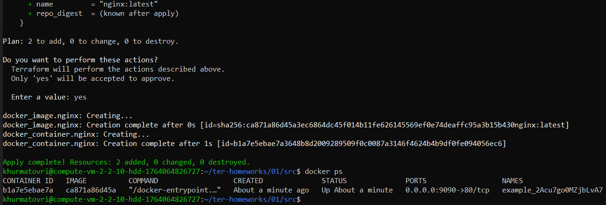

6. Заменим имя контейнера на ```hello_world```
```
resource "docker_container" "nginx" {
  image = docker_image.nginx.image_id
  name  = "hello_world"

  ports {
    internal = 80
    external = 9090
  }
}
```

Выполните команду ```terraform apply -auto-approve``` и ```docker ps```
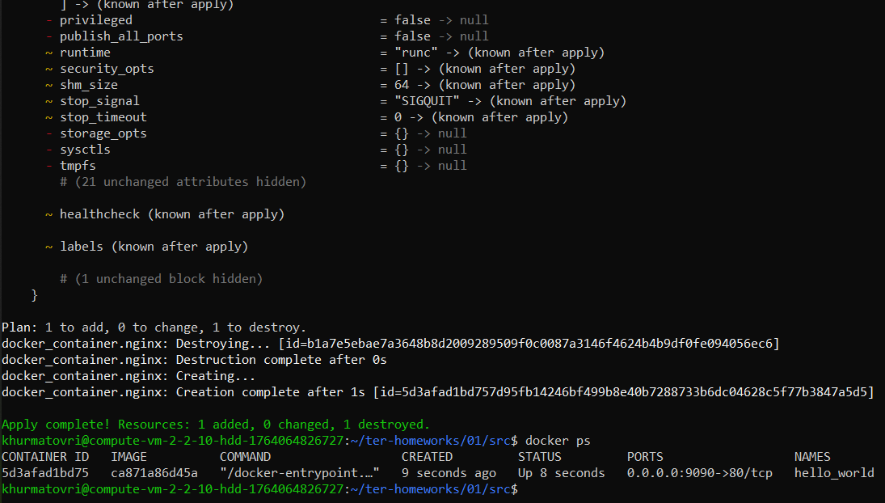

Опасность применение ключа ```-auto-approve``` происходит без подтверждения команды от инженера, что негативно может сказаться на изменениях в инфраструктуре

8. Уничтожим созданные ресурсы командой ```terraform destroy```:
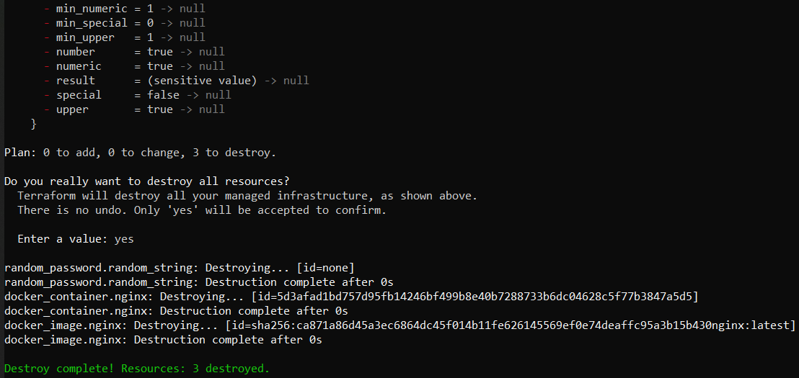

Содержимое файла **terraform.tfstate** после выполнения ```terraform destroy```:
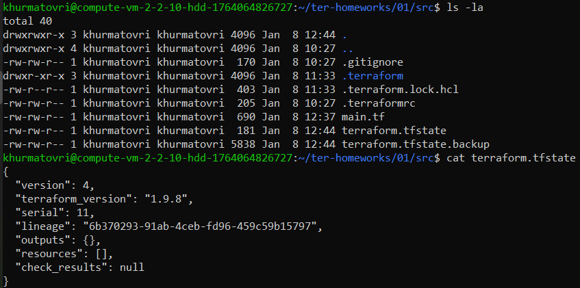

Подтверждение, что все ресурсы удалены:
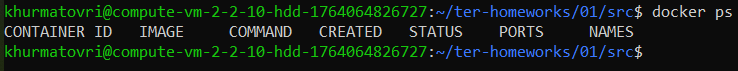

8. После изучения документации можно сделать вывод, что ключ ```keep_locally``` должен определять хранить ли docker image после скачивания
Посмотрев код, увидим, что данный ключ у нас находится со значением ```true```, поэтому docker image не был удален после выполнения команды destroy:
```
resource "docker_image" "nginx" {
  name         = "nginx:latest"
  keep_locally = true
}
```

------

## Дополнительное задание (со звёздочкой*)

**Настоятельно рекомендуем выполнять все задания со звёздочкой.** Они помогут глубже разобраться в материале.   
Задания со звёздочкой дополнительные, не обязательные к выполнению и никак не повлияют на получение вами зачёта по этому домашнему заданию.

### Задание 2*

1. Создайте в облаке ВМ. Сделайте это через web-консоль, чтобы не слить по незнанию токен от облака в github(это тема следующей лекции). Если хотите - попробуйте сделать это через terraform, прочитав документацию yandex cloud. Используйте файл ```personal.auto.tfvars``` и гитигнор или иной, безопасный способ передачи токена!
2. Подключитесь к ВМ по ssh и установите стек docker.
3. Найдите в документации docker provider способ настроить подключение terraform на вашей рабочей станции к remote docker context вашей ВМ через ssh.
4. Используя terraform и  remote docker context, скачайте и запустите на вашей ВМ контейнер ```mysql:8``` на порту ```127.0.0.1:3306```, передайте ENV-переменные. Сгенерируйте разные пароли через random_password и передайте их в контейнер, используя интерполяцию из примера с nginx.(```name  = "example_${random_password.random_string.result}"```  , двойные кавычки и фигурные скобки обязательны!)
```
    environment:
      - "MYSQL_ROOT_PASSWORD=${...}"
      - MYSQL_DATABASE=wordpress
      - MYSQL_USER=wordpress
      - "MYSQL_PASSWORD=${...}"
      - MYSQL_ROOT_HOST="%"
```

6. Зайдите на вашу ВМ , подключитесь к контейнеру и проверьте наличие секретных env-переменных с помощью команды ```env```. Запишите ваш финальный код в репозиторий.

### Задание 3*
1. Установите [opentofu](https://opentofu.org/)(fork terraform с лицензией Mozilla Public License, version 2.0) любой версии
2. Попробуйте выполнить тот же код с помощью ```tofu apply```, а не terraform apply.
------

### Правила приёма работы

Домашняя работа оформляется в отдельном GitHub-репозитории в файле README.md.   
Выполненное домашнее задание пришлите ссылкой на .md-файл в вашем репозитории.

### Критерии оценки

Зачёт ставится, если:

* выполнены все задания,
* ответы даны в развёрнутой форме,
* приложены соответствующие скриншоты и файлы проекта,
* в выполненных заданиях нет противоречий и нарушения логики.

На доработку работу отправят, если:

* задание выполнено частично или не выполнено вообще,
* в логике выполнения заданий есть противоречия и существенные недостатки. 

